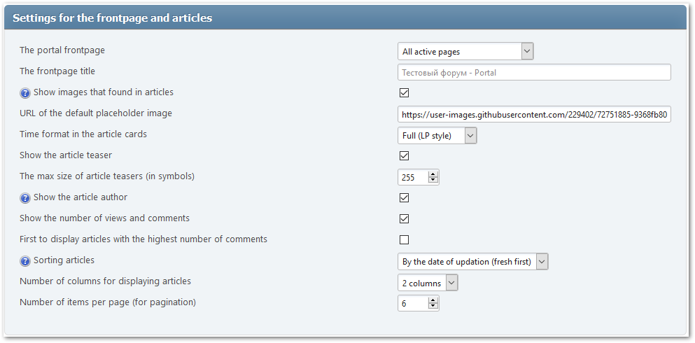
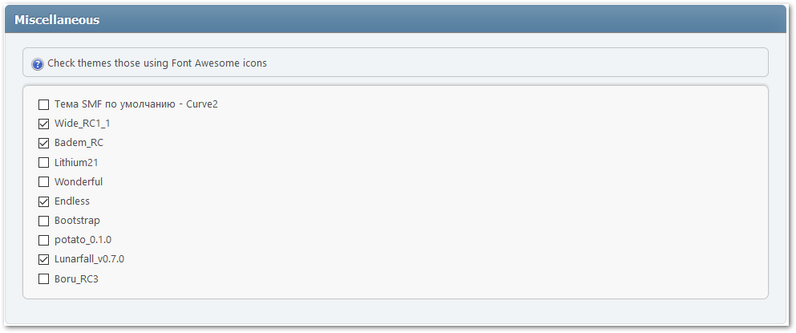

# Portal settings
Use the quick access through the item in the main forum menu or the corresponding section in the admin panel to open the portal settings.

## General settings
In this section, you can fully customize the portal frontpage, enable standalone mode, and change user permissions to access portal items.

### Settings for the frontpage and articles

* The portal frontpage — choose what to display on the main page of the portal:
    * Disabled
    * Specified page (only the selected page will be displayed)
    * All pages from selected categories
    * Selected pages
    * All topics from selected boards
    * Selected topics
    * Selected boards
* The frontpage title — you can change the name of the portal used as the page title and the title of the browser tab.
* Categories - sources of articles for the frontpage — allows you to select portal categories for these frontpage modes: "All pages from selected categories" and "Selected pages".
* Boards - sources of articles for the frontpage — allows you to select boards for these frontpage modes: "All topics from selected boards", "Selected pages", and "Selected board".
* Show images that found in articles — check whether to display images found in the text of pages or topics.
* URL of the default placeholder image — if the option above is enabled, but the image is not found in the text, the one specified here will be used.
* Time format in the article cards — you can change the time format.
* Show the article teaser — check whether to display the description (summary) in the article cards.
* The max size of article teasers (in symbols) — maximum number of characters displayed as description in the article cards.
* Show the article author
* Show the number of views and comments
* First to display articles with the highest number of comments — you can display the most commented articles first, regardless of the selected sorting type.
* Sorting articles — you can choose the type of sorting of articles on the frontpage.
* Number of columns for displaying articles — specify the number of columns in which the article cards will be displayed.
* Number of items per page (for pagination) — specify the maximum number of cards to display on one page.

### Standalone mode

* Enable — Standalone mode switcher, displays or hides the following settings.
* The frontpage URL in the standalone mode — specify the URL where the main page of the portal will be available.
* Disabled actions — you can specify areas of the forum that should not be displayed in the standalone mode.

### Permissions

* Who can view the portal elements — by "elements" we mean blocks and pages.
* Who can manage own pages — you can choose user groups who can create, edit and delete pages.
* Who can post the portal pages without approval — you can choose user groups who will be able to post portal pages without moderation.

## Pages and blocks
In this section, you can change the general settings of pages and blocks used both when creating them and when displaying them.

* Show information about the page permissions — if you need a reminder about who can see the page you are viewing.
* Show keywords at the top of the page — if keywords are specified for a page, they will appear at the top of the page
* Show items on tag/category pages as cards — you can display items as a table, or as cards.
* Show related pages block — if a page has similar pages (by title and alias), they will be displayed at the bottom of the page.
* Show comments block — if you are allowed to comment a page, a comment form will be displayed at the bottom of the page.
* Allowed BBC in comments — you can specify tags that are allowed to be used when commenting pages.
* Maximum time after commenting to allow edit — after the specified time (after creating a comment), you will not be able to change comments.
* Number of parent comments per page — specify the maximum number of non-children comments to display on a single page.
* The type of page editor by default — if you constantly create pages of the same type, you can set this type as default.
* Permissions for pages and blocks by default — if you constantly create pages and blocks with the same permissions, you can set these permissions as default.
* Hide active blocks in the admin area — if blocks bother you in the admin panel, you can hide them.

### Schema microdata markup for contacts
These settings can be useful if your forum is owned by a company or organization. In other cases, you can limit yourself to using an image from the text of the article, ignoring other points.

* Use an image from the page content
* Address of your organization
* Phone of your organization

## Categories
In this section, you can manage categories for categorizing portal pages. If you need it, of course.

## Panels
In this section, you can change some of the settings for existing portal panels and customize the display (direction) of blocks in these panels.

Here you can quickly rearrange some panels without dragging blocks from one panel to another:
* Swap the header and the footer
* Swap the left panel and the right panel
* Swap the center (top) and the center (bottom)

## Miscellaneous
In this section, you can change various auxiliary settings of the portal, which may be useful for developers of templates and plugins.

* Check themes those using Font Awesome icons — if some icons are not displayed when using a third-party theme, enable this theme here.

### Debugging and caching

* Show the loading time and number of the portal queries — useful information for administrators and plugin creators.
* The cache update interval — after a specified amount of time (in seconds), the cache of each portal item will be cleared.