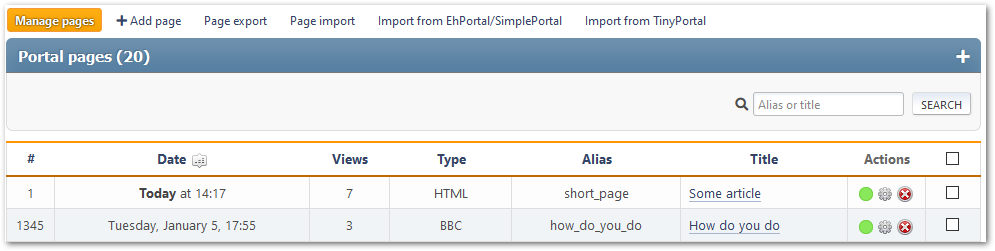

# Manage pages
This section lists all created portal pages that can be edited by the current user. There is a search for pages by title or alias.

For each page, its ID, creation/update date, number of views, number of comments, type, alias, title, and list of actions are displayed.

The following actions are available for each page:
* Toggle status (enable or disable)
* Edit — change the selected page
* Delete

Mass actions with pages are also available.