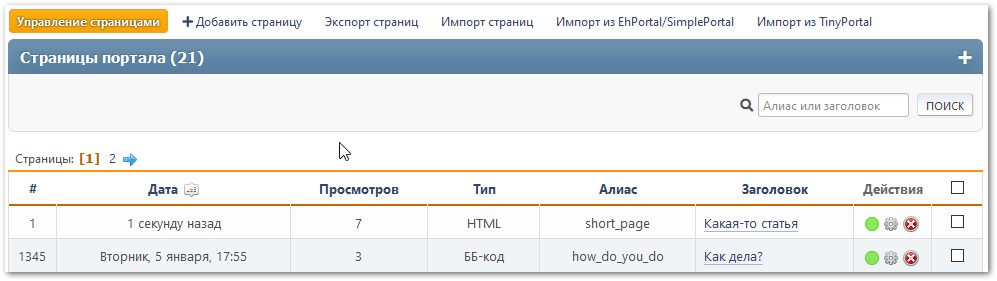

# Управление страницами
В этом разделе перечислены все созданные страницы портала, доступные для редактирования текущему пользователю. Есть поиск страниц по заголовку или алиасу.

Для каждой страницы отображаются её идентификатор, дата создания/обновления, количество просмотров, тип, алиас, заголовок и список действий.

Для каждой страницы доступны следующие действия:
* Переключение статуса (включена или отключена)
* Правка — изменение выбранной страницы
* Удаление

Также доступны массовые действия со страницами.