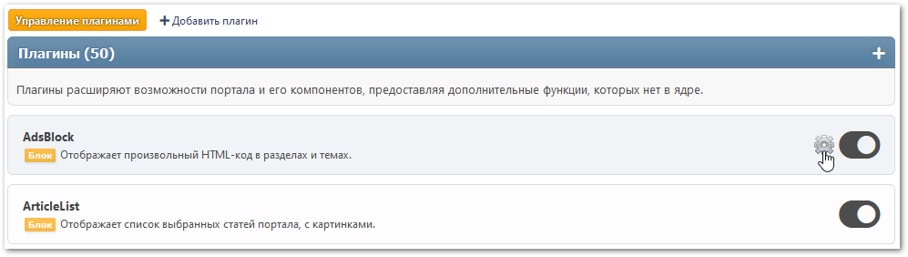

# Управление плагинами
Здесь перечислены все установленные плагины портала. Некоторые из них имеют свои настройки.

При желании можно переключаться между отображением плагинов в 1 колонку (по умолчанию) или в 2 колонки.

Для доступа к настройкам конкретного плагина нажмите на шестеренку рядом с кнопкой включения/отключения.

