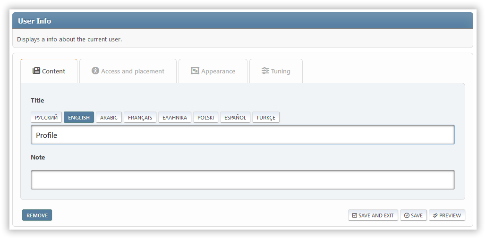
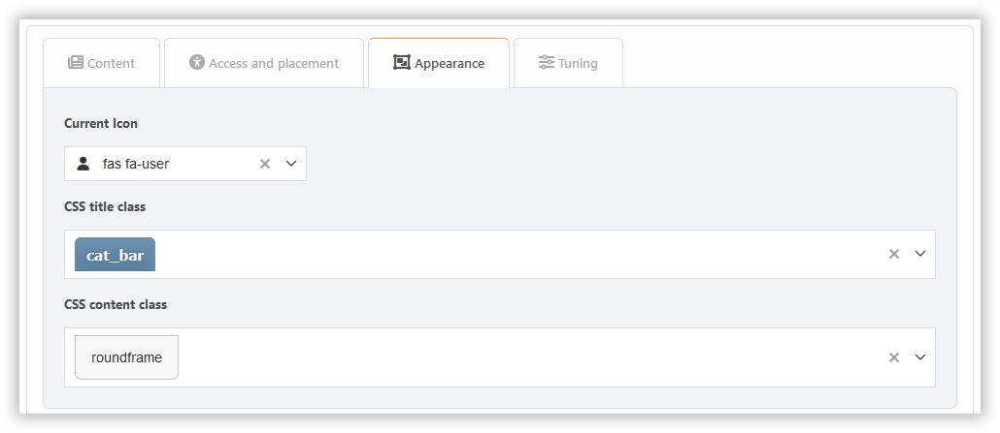

# إضافة إضافة

لإضافة كتلة، ما عليك سوى النقر عليها. في البداية، يمكنك إنشاء كتل من ثلاثة أنواع: PHP و HTML و BBCode. إذا كنت بحاجة إلى أنواع أخرى، أولاً [قم بتمكين الإضافات اللازمة](../plugins/manage) من نوع `block`.

تبعاً لنوع الكتلة، ستكون مختلف الإعدادات متوفرة، موزعة عبر علامات تبويب مختلفة.

## Block types

### Built-in content types

- **BBC**: Allows BBCode markup for content
- **HTML**: Raw HTML content
- **PHP**: Executable PHP code (admin only)

### Plugin-based blocks

Blocks from plugins extend functionality. Examples:

- **Markdown**: Enables Markdown syntax for content
- **ArticleList**: Displays articles from topics/pages with customizable display options
- **Calculator**: Interactive calculator widget
- **BoardStats**: Forum board statistics
- **News**: Latest announcements
- **Polls**: Active forum polls
- **RecentPosts**: Recent forum activity
- **UserInfo**: Current user details
- **WhosOnline**: Online users list

## محتوى

هنا يمكنك تكوين:

- title
- note
- محتوى (لبعض الكتل فقط)

## علامة التبويب للوصول إلى الموقع

هنا يمكنك تكوين:

- موضع
- الأذونات
- المناطق

## علامة تبويب المحتوى

Here you can configure the block appearance options.

## علامة تبويب الضبط

عادةً ما تكون أدوات الضبط الخاصة بالكتل متاحة في علامة تبويب **الضبط**.

يمكن أن تضيف الإضافات تخصيصاتها الخاصة إلى أي من هذه الأقسام، اعتماداً على نوايا المطورين.
