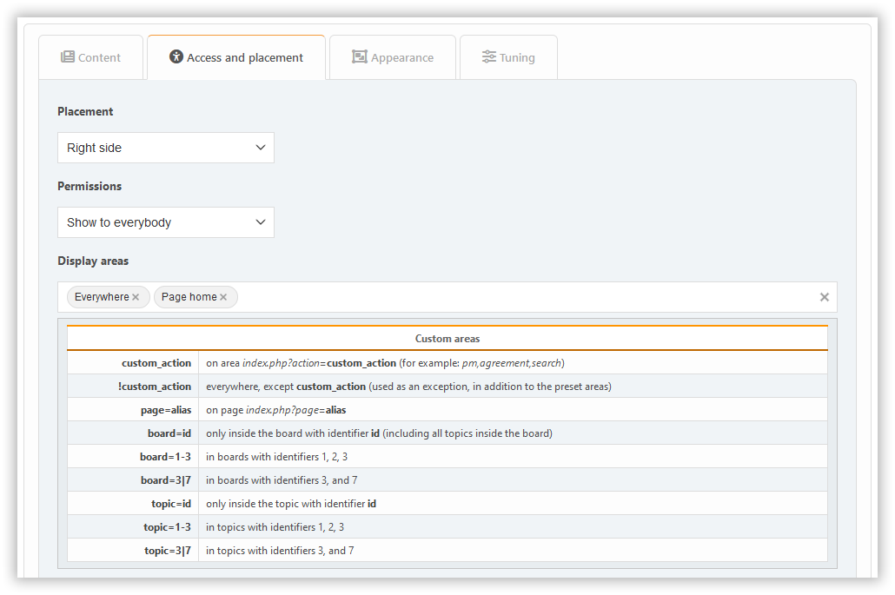

# إضافة إضافة

لإضافة كتلة، ما عليك سوى النقر عليها. في البداية، يمكنك إنشاء كتل من ثلاثة أنواع: PHP و HTML و BBCode. إذا كنت بحاجة إلى أنواع أخرى، أولاً [قم بتمكين الإضافات اللازمة](../plugins/manage) من نوع `block`.

تبعاً لنوع الكتلة، ستكون مختلف الإعدادات متوفرة، موزعة عبر علامات تبويب مختلفة.

## محتوى

هنا يمكنك تكوين:

- title
- note
- محتوى (لبعض الكتل فقط)

## علامة التبويب للوصول إلى الموقع

هنا يمكنك تكوين:

- موضع
- الأذونات
- المناطق

## علامة تبويب المحتوى

هنا يمكنك تكوين:

- خيارات المظهر

## علامة تبويب الضبط

عادةً ما تكون أدوات الضبط الخاصة بالكتل متاحة في علامة تبويب **الضبط**.

يمكن أن تضيف الإضافات تخصيصاتها الخاصة إلى أي من هذه الأقسام، اعتماداً على نوايا المطورين.
