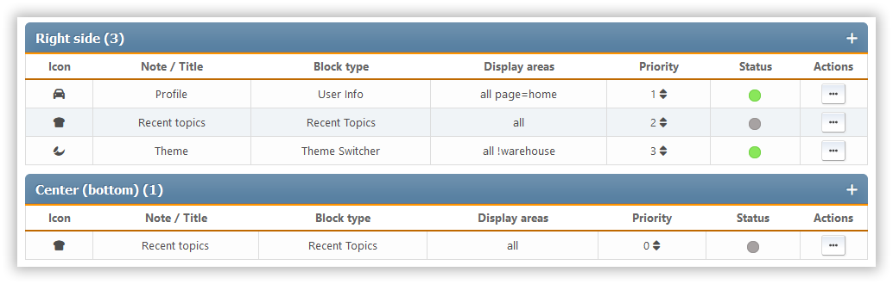

# إدارة المربعات البرمجية

This section shows all the portal blocks that are set up, whether they're enabled or disabled. The blocks are sorted by panel.

For each block, we see its icon, description or title, the type, where the output goes, how important it is, and a list of actions that can be done with it.

الإجراءات التالية متاحة لكل صفحة:

- تغيير الأولوية - داخل كل لوحة يمكنك إعداد ترتيب فردي من الكتل
- تبديل الحالة (تمكين أو تعطيل)
- استنساخ - إنشاء كتلة جديدة تنسخ الحالي
- تحرير - تغيير إعدادات كتلة محددة
- حذف
