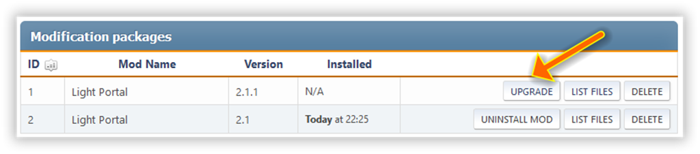

# التحديث

إذا لم تكن هناك ملاحظات في سجل التغييرات لأحدث إصدار، يكفي استخراج الدلائل `Themes` و `Sources` من أرشيف التعديل إلى جذر منتداك، فوق الموجودة بالفعل، وسيكون التحديث صحيحًا. ولكن من الأفضل إلغاء تثبيت الإصدار الحالي قبل تثبيت الإصدار الجديد.

:::info ملاحظة

If the new version can be installed without removing the previous one, you'll see the "Upgrade" button instead of the "Install" button:

:::
