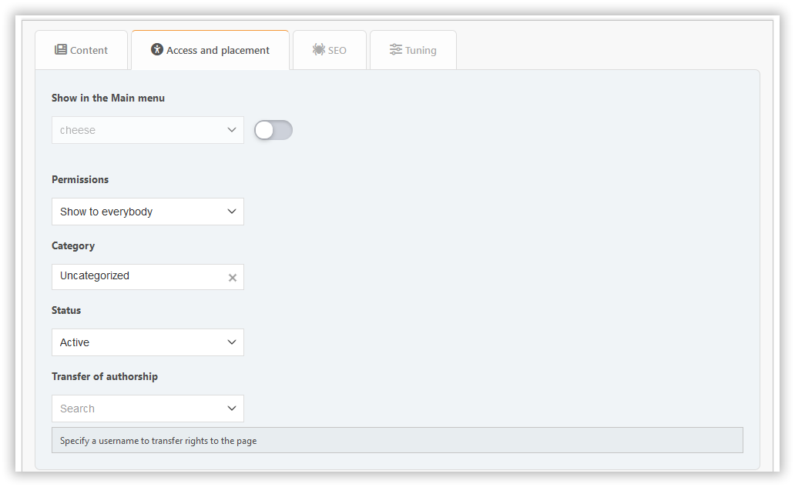

# إضافة صفحة

في هذا القسم، يمكنك إنشاء صفحة بوابة مع المحتوى الذي تحتاجه. الحقول المطلوبة تم تسليط الضوء عليها مع إطار ملون.

## محتوى

هنا يمكنك تكوين:

- العنوان
- نوع الصفحة
- محتوى

## علامة التبويب للوصول إلى الموقع

هنا يمكنك تكوين:

- الأذونات – تحديد من سيتمكن من الوصول إلى صفحتك
- الفئة - إذا كنت ترغب في الحفاظ على تنظيم الأشياء
- نقل المؤلف - إذا كنت ترغب في تغيير المؤلف

## SEO tab

هنا يمكنك تكوين:

- slug - هو الجزء من عنوان URL للصفحة (`?page=slug`)
- الوصف - الوصف الوصفي
- العلامات - سيتم عرضها كعلامات الصفحات والكلمات الرئيسية للميتا

## علامة تبويب الضبط

هنا يمكنك تكوين:

- تاريخ ووقت النشر - يمكن نشر الصفحة في جدول زمني
- عرض العنوان - يمكن تعطيله إذا كان لديك رأس خاص بك على الصفحة
- عرض المؤلف وتاريخ الإنشاء
- عرض الصفحات ذات الصلة
- تعليقات - يمكنك السماح بها أو رفضها بشكل منفصل لكل صفحة

