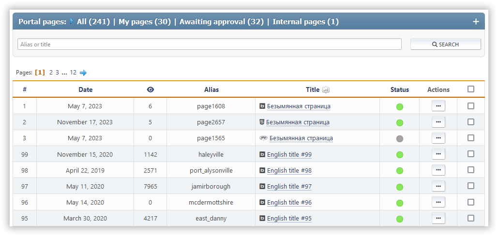

# إدارة الصفحات

يسرد هذا القسم جميع صفحات البوابة التي تم إنشاؤها والتي يمكن تعديلها من قبل المستخدم الحالي. هناك بحث عن الصفحات حسب العنوان أو السحب.

لكل صفحة، معرفه، تاريخ الإنشاء/التحديث، عدد المشاهدات، عدد التعليقات، النوع، الخربش، العنوان، قائمة الإجراءات.

الإجراءات التالية متاحة لكل صفحة:

- تبديل الحالة (تمكين أو تعطيل)
- تعديل — تغيير الصفحة المحددة
- حذف

الإجراءات الجماعية مع الصفحات متاحة أيضا.
