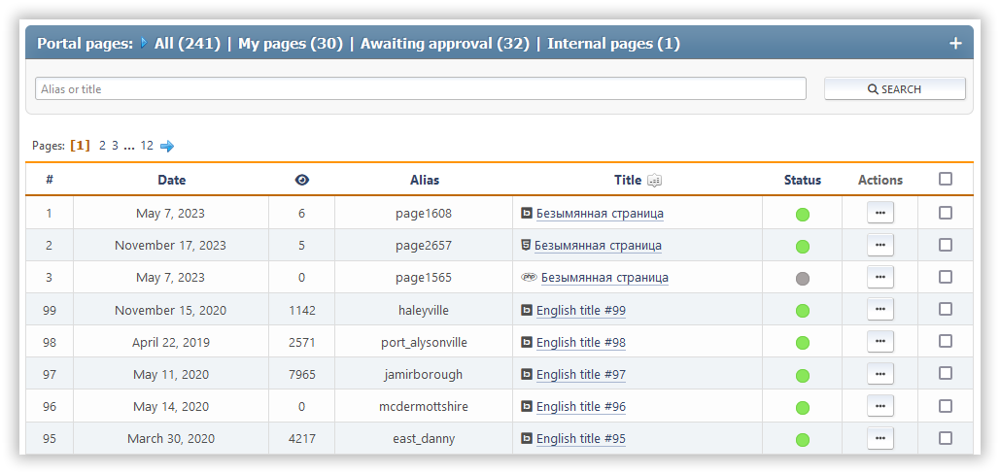

# إدارة الصفحات

This section shows all the pages you've created that you can edit. You can search for them by their title or slug.

Each page shows its ID, creation or last updated date, view count, comment count, page type, slug, and title. You also see a list of actions you can do with it.

الإجراءات التالية متاحة لكل صفحة:

- تبديل الحالة (تمكين أو تعطيل)
- تعديل — تغيير الصفحة المحددة
- حذف

الإجراءات الجماعية مع الصفحات متاحة أيضا.
