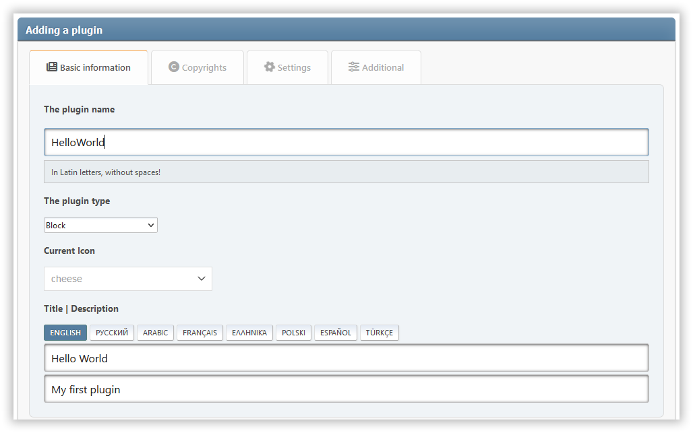

# إضافة إضافة

الإضافات هي الإضافات التي توسع قدرات بوابة الضوء. لإنشاء البرنامج المساعد الخاص بك، فقط اتبع الإرشادات أدناه.

:::info ملاحظة

يمكنك استخدام **الإضافات** كمساعد لإنشاء الإضافات الخاصة بك. قم بتنزيله وتمكينه على صفحة _Admin -> إعدادات البوابة -> الإضافات_.



:::

## اختيار نوع الملحق

تتوفر حاليا الأنواع التالية من الإضافات:

### `block`

الإضافات التي تضيف نوعا جديدا من البلوكات للبوابة.

### `ssi`

الإضافات (عادة كتل) التي تستخدم وظائف SSI لاسترداد البيانات.

### `editor`

الإضافات التي تضيف محرر ثالث لأنواع مختلفة من المحتوى.

### `comment`

الإضافات التي تضيف أداة تعليق طرف ثالث بدلاً من المدمجة.

### `parser`

الإضافات التي تنفذ المحلل لمحتوى الصفحات والكتل.

### `article`

الإضافات لمعالجة محتوى بطاقات المقالات في الصفحة الرئيسية.

### `frontpage`

الإضافات لتغيير الصفحة الرئيسية من البوابة.

### `impex`

الإضافات لاستيراد وتصدير مختلف عناصر البوابة.

### `block_options` | `page_options`

الإضافات التي تضيف معلمات إضافية للكيان المقابل (الكتلة أو صفحة).

### `icons`

الإضافات التي تضيف مكتبات الأيقونات الجديدة لاستبدال عناصر الواجهة أو لاستخدامها في رؤوس الكتل

### `seo`

الإضافات التي تؤثر بطريقة ما على بروز المنتدى على الشبكة.

### `other`

الإضافات التي لا تتصل بأي من الفئات أعلاه.

## إنشاء دليل البرنامج المساعد

أنشئ مجلدًا منفصلًا لملفات المكون الإضافي الخاصة بك، داخل `/Sources/LightPortal/Plugins`. على سبيل المثال، إذا كان البرنامج المساعد الخاص بك يسمى \`HelloWorld'، يجب أن تبدو بنية المجلد مثل هذا:

```
...(Plugins)
└── HelloWorld/
    ├── langs/
    │   ├── english.php
    │   └── index.php
    ├── index.php
    └── HelloWorld.php
```

يمكن نسخ الملف `index.php` من مجلدات الإضافات الأخرى. الملف `HelloWorld.php` يحتوي على منطق الإضافة:

```php:line-numbers
<?php

namespace Bugo\LightPortal\Plugins\HelloWorld;

use Bugo\Compat\{Config, Lang, Utils};
use Bugo\LightPortal\Plugins\Plugin;

if (! defined('LP_NAME'))
	die('No direct access...');

class HelloWorld extends Plugin
{
    // FA icon (for blocks only)
    public string $icon = 'fas fa-globe';

    // Your plugin's type
    public string $type = 'other';

    // Optional init method
    public function init(): void
    {
        // Access to global variables: Utils::$context['user'], Config::$modSettings['variable'], etc.
        // Access to language variables: Lang::$txt['lp_hello_world']['variable_name']
    }

    // Custom properties and methods
}

```

## استخدام SSI

إذا كان البرنامج المساعد يحتاج إلى استرداد أي بيانات باستخدام دوال SSI، استخدم طريقة `getFromSsi(السلسلة $function، ...$params)` المدمجة. كمعلمة `$function` يجب عليك تمرير اسم إحدى الدوال الواردة في الملف **SSI.php**، بدون بادئة `ssi_`. وعلى سبيل المثال:

```php
<?php

// See ssi_topTopics function in the SSI.php file
$data = $this->getFromSSI('topTopics', 'views', 10, 'array');
```

## استخدام الملحن

يمكن للملحق الخاص بك استخدام مكتبات الطرف الثالث المثبتة من خلال الملحن. تأكد من أن ملف 'composer.json' الذي يحتوي على التبعيات الضرورية، موجود في الدليل الإضافي. قبل نشر الإضافة الخاصة بك، افتح دليل الإضافات في سطر الأوامر وتشغيل الأمر: `composer install --no-dev -o`. بعد ذلك، يمكن تعبئة محتويات الدليل المساعد بكاملها كتعديل منفصل لـ SMF (على سبيل المثال راجع حزمة **PluginMaker**).
