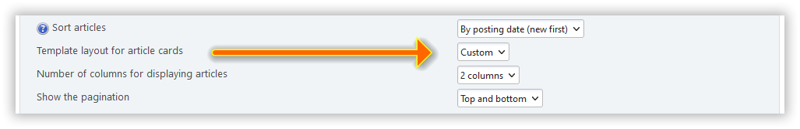

# Δημιουργήστε προσαρμοσμένες διατάξεις

Το Light Portal χρησιμοποιεί ένα ευέλικτο σύστημα προτύπων που βασίζεται στο [BladeOne](https://github.com/EFTEC/BladeOne), μια αυτόνομη υλοποίηση της μηχανής δημιουργίας προτύπων Blade του Laravel. Αυτό το σύστημα σάς επιτρέπει να προσαρμόσετε την εμφάνιση και τη δομή της πύλης σας μέσω διατάξεων, θεμάτων και επαναχρησιμοποιήσιμων στοιχείων.

## Σύστημα προτύπων

### Μηχανή δημιουργίας προτύπων Blade

Το Blade είναι μια ισχυρή μηχανή δημιουργίας προτύπων που παρέχει καθαρή, ευανάγνωστη σύνταξη για την ανάμειξη PHP με HTML. Βασικά χαρακτηριστικά:

- **Κληρονομικότητα προτύπου**: Χρησιμοποιήστε τις οδηγίες `@extends` και `@section` για να δημιουργήσετε ιεραρχίες διάταξης
- **Περιλαμβάνει**: Επαναχρησιμοποίηση στοιχείων με οδηγίες `@include`
- **Δομές Ελέγχου**: Σύνταξη τύπου PHP με `@if`, `@foreach`, `@while`, κ.λπ.

Δείτε αναλυτικές πληροφορίες σχετικά με τη σήμανση Blade [εδώ](https://github.com/EFTEC/BladeOne/wiki/Template-variables).

### Διατάξεις

Οι διατάξεις καθορίζουν τη συνολική δομή της αρχικής σας σελίδας. Βρίσκονται στο `/Themes/default/LightPortal/layouts/` και καθορίζουν τον τρόπο με τον οποίο ταξινομούνται τα άρθρα της πρώτης σελίδας. Τα παραδείγματα περιλαμβάνουν:

- `default.blade.php` - Τυπική διάταξη πλέγματος
- `simple.blade.php` - Μινιμαλιστικός σχεδιασμός
- `modern.blade.php` - Σύγχρονο στυλ
- `featured_grid.blade.php` - Πλέγμα επισημασμένου περιεχομένου

### Μερικά ακόμα

Επαναχρησιμοποιήσιμα στοιχεία προτύπου που είναι αποθηκευμένα στο `/Themes/default/LightPortal/layouts/partials/`:

- `base.blade.php` - Κύριο περιτύλιγμα διάταξης
- `card.blade.php` - Πρότυπο κάρτας άρθρου
- `pagination.blade.php` - Πλοήγηση σελίδας
- `image.blade.php` - Στοιχείο εμφάνισης εικόνας

### Θέματα και στοιχεία

-
- `/languages/LightPortal`: Αρχεία τοπικής προσαρμογής
- `/css/light_portal`: Βελτιώσεις CSS
- `/scripts/light_portal`: Βελτιώσεις JavaScript

## Παράδειγμα διάταξης

Εκτός από τις υπάρχουσες διατάξεις αρχικής σελίδας, μπορείτε πάντα να προσθέσετε τις δικές σας.

Για να το κάνετε αυτό, δημιουργήστε ένα αρχείο «custom.blade.php» στον κατάλογο «/Themes/default/portal_layouts»:

```php:line-numbers {6,16}
@extends('partials.base')

@section('content')
	<!-- <div> @dump($context['user']) </div> -->

	<div class="lp_frontpage_articles article_custom">
		@include('partials.pagination')

		@foreach ($context['lp_frontpage_articles'] as $article)
			<div class="
				col-xs-12 col-sm-6 col-md-4
				col-lg-{{ $context['lp_frontpage_num_columns'] }}
				col-xl-{{ $context['lp_frontpage_num_columns'] }}
			">
				<figure class="noticebox">
					{!! parse_bbc('[code]' . print_r($article, true) . '[/code]') !!}
				</figure>
			</div>
		@endforeach

		@include('partials.pagination', ['position' => 'bottom'])
	</div>
@endsection

<style>
.article_custom {
	// Your CSS
}
</style>
```

Στη συνέχεια, θα δείτε μια νέα διάταξη αρχικής σελίδας - `Προσαρμοσμένη` - στις ρυθμίσεις της πύλης:



Μπορείτε να δημιουργήσετε όσες τέτοιες διατάξεις θέλετε. Χρησιμοποιήστε το "debug.blade.php" και άλλες διατάξεις στον κατάλογο \`/Themes/default/LightPortal/layouts ως παραδείγματα.

## Προσαρμογή CSS

Μπορείτε εύκολα να αλλάξετε την εμφάνιση οποιουδήποτε πράγματος προσθέτοντας τα δικά σας στυλ. Απλώς δημιουργήστε ένα νέο αρχείο με το όνομα `portal_custom.css` στον κατάλογο `Themes/default/css` και τοποθετήστε το CSS σας εκεί.

:::tip Συμβουλή

Εάν έχετε δημιουργήσει το δικό σας πρότυπο αρχικής σελίδας και θέλετε να το μοιραστείτε με τον προγραμματιστή και άλλους χρήστες, χρησιμοποιήστε τη διεύθυνση https://codepen.io/pen/ ή άλλους παρόμοιους πόρους.

:::
