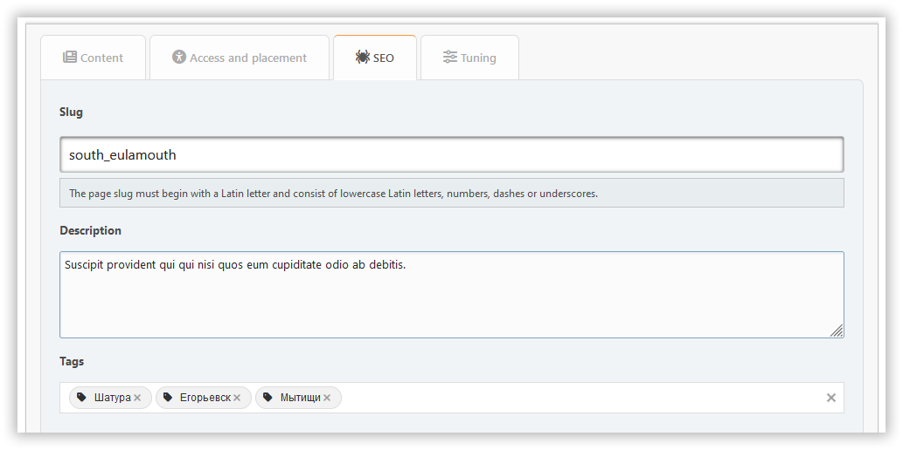

# Προσθήκη σελίδας

Σε αυτήν την ενότητα, μπορείτε να δημιουργήσετε μια σελίδα πύλης με το περιεχόμενο που χρειάζεστε. Τα υποχρεωτικά πεδία επισημαίνονται με έγχρωμο πλαίσιο.

## Καρτέλα περιεχομένου

Εδώ μπορείτε να διαμορφώσετε:

- τίτλος
- τύπος σελίδας
- περιεχόμενο

## Καρτέλα πρόσβασης και τοποθέτησης

Εδώ μπορείτε να διαμορφώσετε:

- δικαιώματα — καθορίστε ποιος θα έχει πρόσβαση στη σελίδα σας
- κατηγορία — αν σας αρέσει να κρατάτε τα πράγματα οργανωμένα
- μεταβίβαση της συγγραφής — εάν θέλετε να αλλάξετε τον συγγραφέα

## καρτέλα SEO

Εδώ μπορείτε να διαμορφώσετε:

- ψευδώνυμο — η σελίδα θα είναι διαθέσιμη στη διεύθυνση `?page=alias`
- περιγραφή — η μετα-περιγραφή
- λέξεις-κλειδιά — οι μετα λέξεις-κλειδιά

## Καρτέλα συντονισμού

Εδώ μπορείτε να διαμορφώσετε:

- ημερομηνία και ώρα δημοσίευσης — η σελίδα μπορεί να δημοσιευτεί βάσει χρονοδιαγράμματος
- εμφάνιση του τίτλου — μπορεί να απενεργοποιηθεί εάν έχετε τη δική σας κεφαλίδα στη σελίδα
- εμφάνιση του συγγραφέα και της ημερομηνίας δημιουργίας
- εμφάνιση σχετικών σελίδων
- σχόλια — μπορείτε να τα επιτρέψετε ή να τα απορρίψετε ξεχωριστά για κάθε σελίδα

