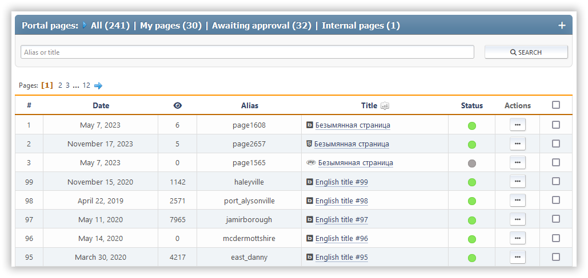

# Διαχείριση σελίδων

This section shows all the pages you've created that you can edit. You can search for them by their title or slug.

Each page shows its ID, creation or last updated date, view count, comment count, page type, slug, and title. You also see a list of actions you can do with it.

Οι ακόλουθες ενέργειες είναι διαθέσιμες για κάθε σελίδα:

- Εναλλαγή κατάστασης (ενεργοποίηση ή απενεργοποίηση)
- Επεξεργασία — αλλάξτε την επιλεγμένη σελίδα
- Διαγραφή

Διατίθενται επίσης μαζικές δράσεις με σελίδες.
