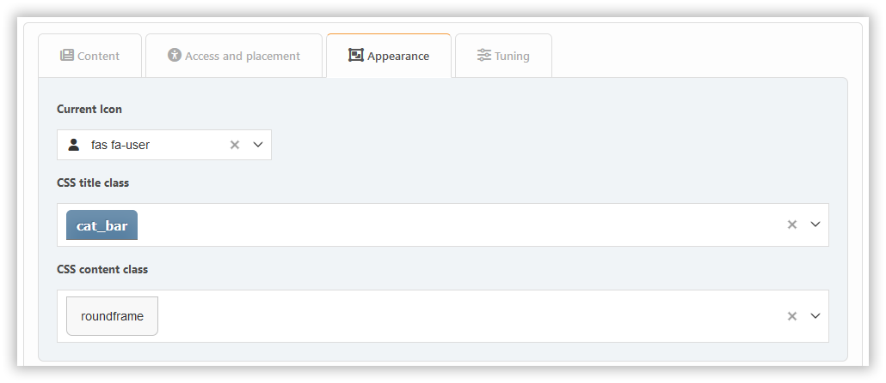

# Add block

To add a block, simply click on it. Initially, you can create blocks of three types: PHP, HTML, and BBCode. If you need others, first [enable the necessary plugins](../plugins/manage) of type `block`.

Depending on the type of block, various settings will be available, spread across different tabs.

## Content tab

Here you can configure:

- title
- note
- content (for some blocks only)

## Access and placement tab

Here you can configure:

- placement
- permissions
- areas

## Appearance tab

Here you can configure:

- appearance options

## Tuning tab

Block-specific tuners are usually available on the **Tuning** tab.

Plugins can add their own customizations to any of these sections, depending on the developers' intentions.
