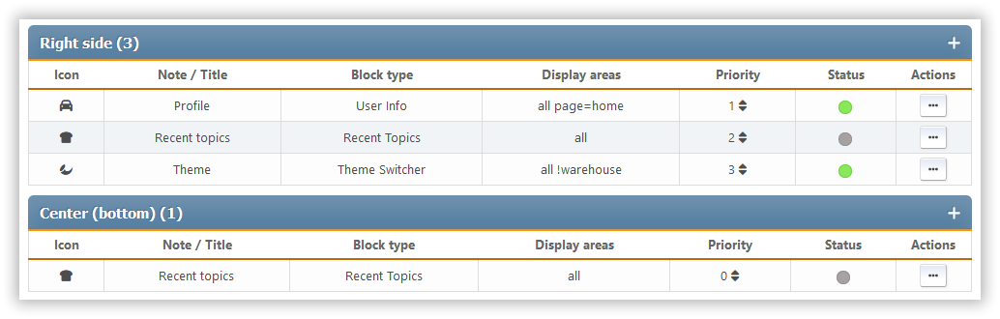

# Manage blocks

This section shows all the portal blocks that are set up, whether they're enabled or disabled. The blocks are sorted by panel.

For each block, we see its icon, title or description, type, output panel, priority, and a list of available actions.

The following actions are available for each block:

- Change of priority - inside each panel you can set up an individual order of blocks
- Toggle status (enable or disable)
- Clone — creates a copy of the block
- Edit - change the settings of a specific block
- Delete
