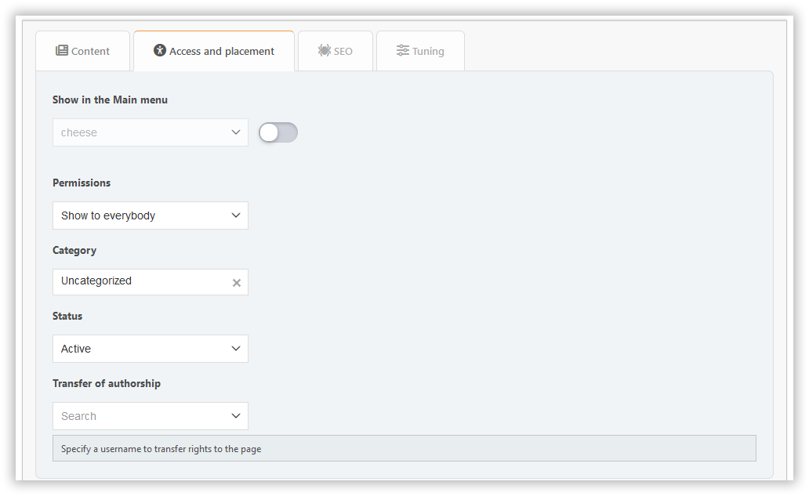

# Add page

In this section, you can create a portal page with the content you need.

## Page types

### Built-in content types

- **BBC**: Allows BBCode markup for content
- **HTML**: Raw HTML content
- **PHP**: Executable PHP code (admin only)

### Plugin-based pages

Plugins can extend the functionality by adding new page types or statuses. Examples:

- **Markdown**: Enables Markdown syntax for content
- **Blog**: Blog-style pages provided by the BlogMode plugin

## Content tab

Here you can configure:

- title
- content

## Access and placement tab

Here you can configure:

- status — inactive, active, or unapproved
- permissions — specify who will access your page
- category — if you like to keep things organized
- type — default, internal, or draft

## SEO tab

Here you can configure:

- slug — is the part of the page URL (`?page=slug`)
- description — the meta description
- tags — will be displayed as page tags and the meta keywords

## Tuning tab

Here you can configure:

- date and time of publication — the page can be published on a schedule
- display the title — can be disabled if you have your own header on the page
- display the author and creation date
- display related pages
- comments — you can allow or deny them separately for each page

