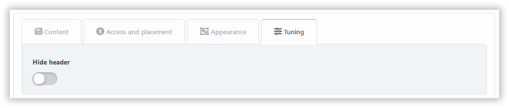

# Agregar bloque

Para agregar un bloque, simplemente haz clic en él. Inicialmente, puedes crear bloques de tres tipos: PHP, HTML y BBCode. Si necesitas otros, primero [habilita los complementos necesarios](../plugins/manage) del tipo `block`.

Dependiendo del tipo de bloque, varias configuraciones estarán disponibles, diseminadas a través de diferentes pestañas.

## Content tab

Aquí puede configurar:

- título
- nota
- contenido (sólo para algunos bloques)

## Pestaña de acceso y colocación

Aquí puede configurar:

- colocación
- permisos
- áreas

## Pestaña Apariencia

Aquí puede configurar:

- opciones de apariencia

## Tuning tab

Los sintonizadores específicos de bloques están normalmente disponibles en la pestaña **Ajuste**.

Los plugins pueden añadir sus propias personalizaciones a cualquiera de estas secciones, dependiendo de las intenciones de los desarrolladores.
