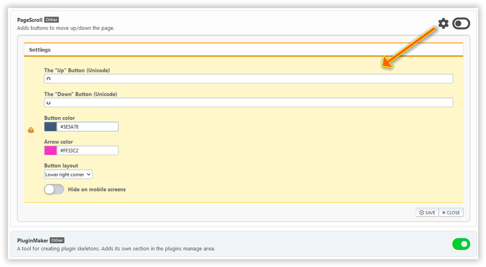
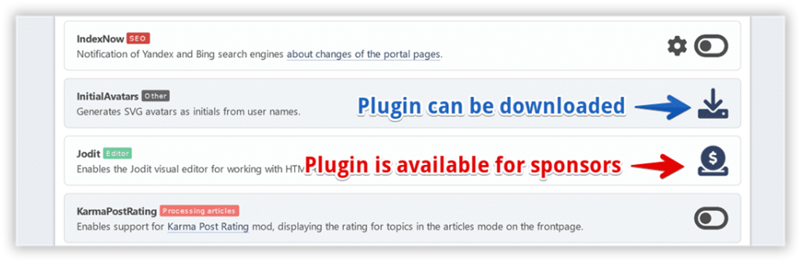

# Administrar complementos

Todos los plugins de portal instalados están listados aquí. Algunos de ellos tienen su propio entorno.

Puede cambiar entre mostrar plugins en 1 columna (por defecto) o 2 columnas si lo desea.

Si desea cambiar la configuración del plugin, haga clic en el engranaje junto al botón de alternar plugin.

## Instalando plugins adicionales

Algunos plugins no están incluidos en el portal, necesitan ser instalados por separado. Estos plugins se dividen en descargas y bonificaciones disponibles para los patrocinadores de proyectos.

The separate plugin package can be installed in the Plugin Import section. Pero también puedes simplemente extraer la carpeta del plugin del archivo descargado y moverla al directorio `Sources/LightPortal/Plugins`.
