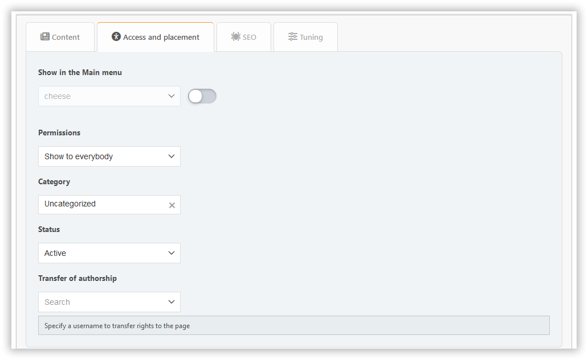
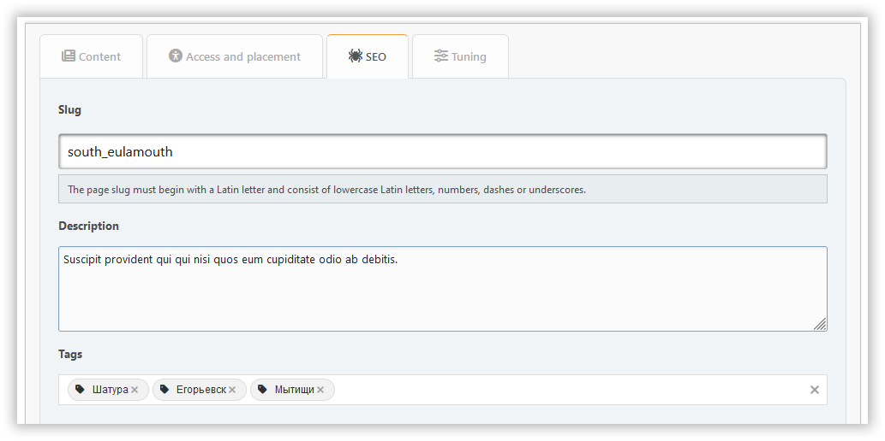

# Ajouter une page

In this section, you can create a portal page with the content you need.

## Page types

### Built-in content types

- **BBC**: Allows BBCode markup for content
- **HTML**: Raw HTML content
- **PHP**: Executable PHP code (admin only)

### Plugin-based pages

Plugins can extend the functionality by adding new page types or statuses. Examples:

- **Markdown**: Enables Markdown syntax for content
- **BlogMode**: Adds a new "Blog entry" type for displaying pages in a separate menu section

## Content tab

Ici, vous pouvez configurer :

- Titre:
- contenu

## Onglet d'accès et de placement

Ici, vous pouvez configurer :

- status — inactive, active, or unapproved
- permissions — spécifiez qui va accéder à votre page
- catégorie — si vous aimez garder les choses organisées
- type — default, internal, or draft

## SEO tab

Ici, vous pouvez configurer :

- slug — est la partie de l'URL de la page (`?page=slug`)
- description — la méta description
- tags — seront affichés en tant que balises de page et les mots-clés méta

## Tuning tab

Ici, vous pouvez configurer :

- date et heure de publication — la page peut être publiée sur un calendrier
- afficher le titre — peut être désactivé si vous avez votre propre en-tête sur la page
- afficher l'auteur et la date de création
- afficher les pages liées
- commentaires — vous pouvez les autoriser ou les refuser séparément pour chaque page

