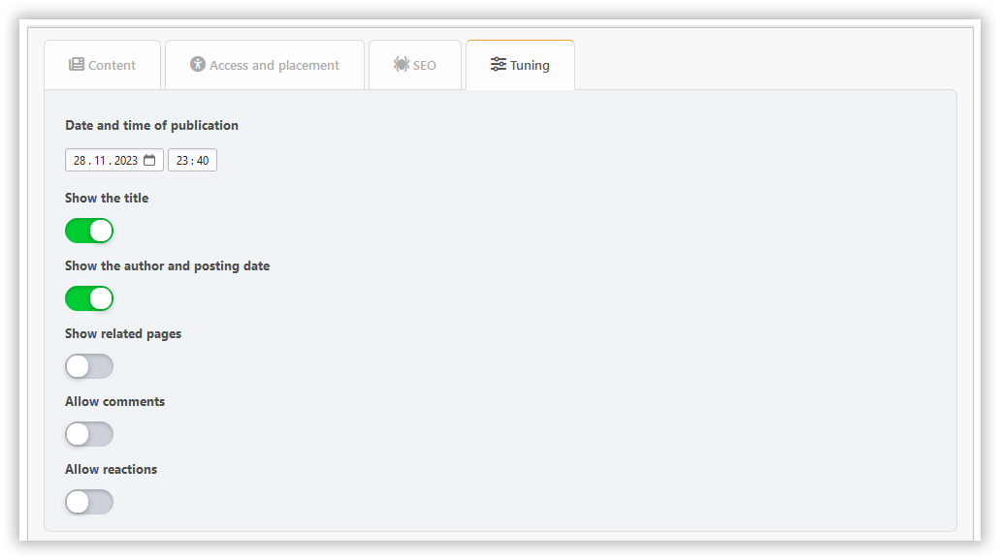

# Ajouter une page

Dans cette section, vous pouvez créer une page de portail avec le contenu dont vous avez besoin. Les champs obligatoires sont surlignés avec un cadre coloré.

## Content tab

Ici, vous pouvez configurer :

- Titre:
- type de page
- contenu

## Onglet d'accès et de placement

Ici, vous pouvez configurer :

- permissions — spécifiez qui va accéder à votre page
- catégorie — si vous aimez garder les choses organisées
- transfert de la paternité — si vous voulez changer l'auteur

## SEO tab

Ici, vous pouvez configurer :

- slug — est la partie de l'URL de la page (`?page=slug`)
- description — la méta description
- tags — seront affichés en tant que balises de page et les mots-clés méta

## Tuning tab

Ici, vous pouvez configurer :

- date et heure de publication — la page peut être publiée sur un calendrier
- afficher le titre — peut être désactivé si vous avez votre propre en-tête sur la page
- afficher l'auteur et la date de création
- afficher les pages liées
- commentaires — vous pouvez les autoriser ou les refuser séparément pour chaque page

