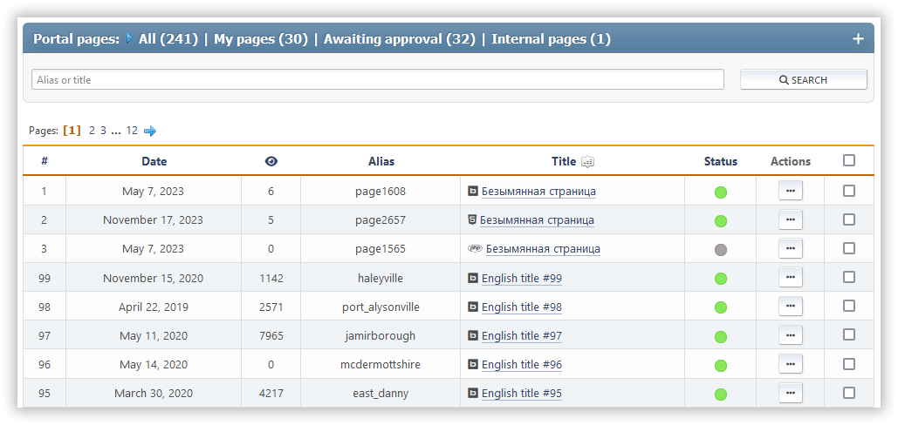

# Gérer les pages

This section shows all the pages you've created that you can edit. You can search for them by their title or slug.

Each page has its ID, when it was created or last updated, how many times it's been viewed, how many comments it has, what kind of page it is, its slug, and its title. You also see a list of actions you can do with it.

Les actions suivantes sont disponibles pour chaque page :

- Activer/désactiver le statut (activer ou désactiver)
- Modifier — modifier la page sélectionnée
- Supprimez

Des actions de masse avec des pages sont également disponibles.
