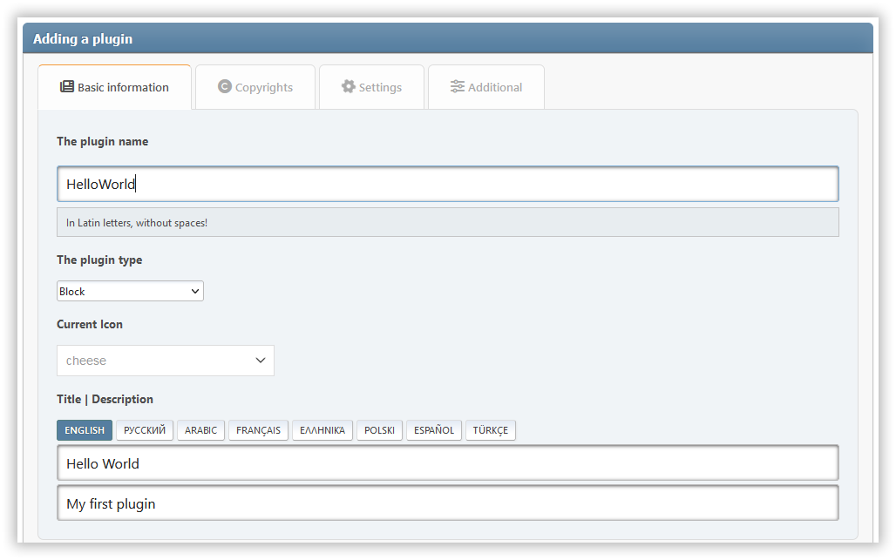

# Ajouter un plugin

Les plugins sont les extensions qui étendent les capacités du portail Lumière. Pour créer votre propre plugin, suivez les instructions ci-dessous.

:::info Note

Tu peux utiliser le **PluginMaker** comme aide pour créer tes propres plugins. Téléchargez et activez-le sur la page _Admin -> Paramètres du portail -> Plugins_.



:::

## Choix du type de plugin

Actuellement, les types de plugins suivants sont disponibles :

| Type                            |                                                                                                                                          Description |
| ------------------------------- | ---------------------------------------------------------------------------------------------------------------------------------------------------: |
| `block`                         |                                                                       Plugins qui ajoutent un nouveau type de blocs pour le portail. |
| `ssi`                           |                  Les plugins (généralement les blocs) qui utilisent les fonctions SSI pour récupérer des données. |
| `editor`                        |                                                              Plugins qui ajoutent un éditeur tiers pour différents types de contenu. |
| `comment`                       |                                                   Les plugins qui ajoutent un widget de commentaire tiers au lieu du widget intégré. |
| `parser`                        |                                                         Plugins qui implémentent l'analyseur pour le contenu des pages et des blocs. |
| `article`                       |                                                   Plugins pour le traitement du contenu des cartes d'article sur la page principale. |
| `frontpage`                     |                                                                                  Plugins pour changer la page principale du portail. |
| `impex`                         |                                                                        Plugins pour importer et exporter divers éléments de portail. |
| `block_options`, `page_options` | Plugins qui ajoutent des paramètres supplémentaires pour l'entité correspondante (bloc ou .page). |
| `icons`                         |                    Plugins qui ajoutent de nouvelles bibliothèques d'icônes pour remplacer les éléments de l'interface ou pour les en-têtes de blocs |
| `seo`                           |                                             Plugins qui affectent d'une manière ou d'une autre la visibilité du forum sur le réseau. |
| `other`                         |                                                                      Les plugins qui ne sont liés à aucune des catégories ci-dessus. |

## Création d'un répertoire de plugins

Créez un dossier séparé pour vos fichiers de plugin, à l'intérieur de `/Sources/LightPortal/Plugins`. Par exemple, si votre plugin est appelé `HelloWorld`, la structure des dossiers devrait ressembler à ceci :

```
...(Plugins)
└── HelloWorld/
    ├── langs/
    │   ├── english.php
    │   └── index.php
    ├── index.php
    └── HelloWorld.php
```

Le fichier `index.php` peut être copié à partir de dossiers d'autres plugins. Le fichier `HelloWorld.php` contient la logique du plugin :

```php:line-numbers {17}
<?php declare(strict_types=1);

namespace Bugo\LightPortal\Plugins\HelloWorld;

use Bugo\Compat\{Config, Lang, Utils};
use Bugo\LightPortal\Plugins\Plugin;

if (! defined('LP_NAME'))
    die('No direct access...');

class HelloWorld extends Plugin
{
    // FA icon (for blocks only)
    public string $icon = 'fas fa-globe';

    // Your plugin's type
    public string $type = 'other';

    // Optional init method
    public function init(): void
    {
        echo 'Hello world!';
    }

    // Hookable and custom methods
}

```

## Utilisation de SSI

Si le plugin a besoin de récupérer des données en utilisant des fonctions SSI, utilisez la méthode intégrée `getFromSsi(string $function, ...$params)`. En tant que paramètre `$function` vous devez passer le nom d'une des fonctions contenues dans le fichier **SSI.php**, sans préfixe `ssi_`. Par exemple :

```php
$data = $this->getFromSSI('topTopics', 'views', 10, 'array');
```

## Utiliser le compositeur

Votre plugin peut utiliser des bibliothèques tierces installées via Composer. Assurez-vous que le fichier `composer.json` qui contient les dépendances nécessaires, se trouve dans le répertoire des plugins. Avant de publier votre plugin, ouvrez le répertoire des plugins en ligne de commande et exécutez la commande : `composer install --no-dev -o`. Après cela, tout le contenu du répertoire de plugins peut être empaqueté comme une modification séparée pour SMF (par exemple voir **PluginMaker**).
