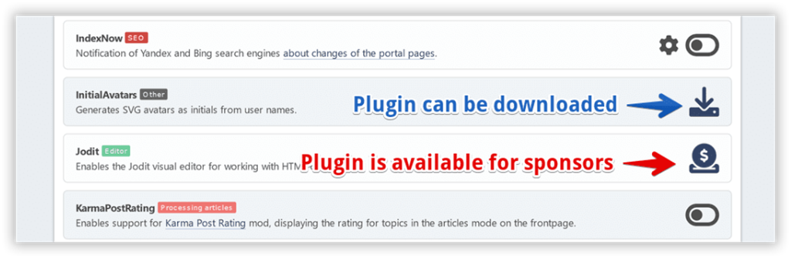

# Gérer les plugins

Tous les plugins de portail installés sont listés ici. Certains d'entre eux ont leurs propres paramètres.

Vous pouvez basculer entre l'affichage des plugins dans 1 colonne (par défaut) ou 2 colonnes si vous le souhaitez.

Si vous voulez modifier les paramètres du plugin, cliquez sur l'engrenage à côté du bouton de bascule du plugin.

## Installation de plugins supplémentaires

Certains plugins ne sont pas inclus avec le portail, ils doivent être installés séparément. Ces plugins sont divisés en modules téléchargeables et en bonus disponibles pour les sponsors.

:::info Note

Des plugins bonus sont également disponibles pour les traducteurs (si au moins `LightPortal.{your_language}. hp` est 100% de qualité traduite), ainsi que pour tous les [participants actifs](../how-to/help-to-project) du projet.

:::

Le package de plugin séparé peut être installé sur la page [Import de plugin](./impex) . Mais vous pouvez également simplement extraire le dossier du plugin de l'archive téléchargée et le déplacer dans le répertoire `Sources/LightPortal/Plugins`.
