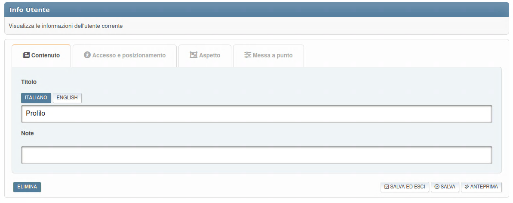
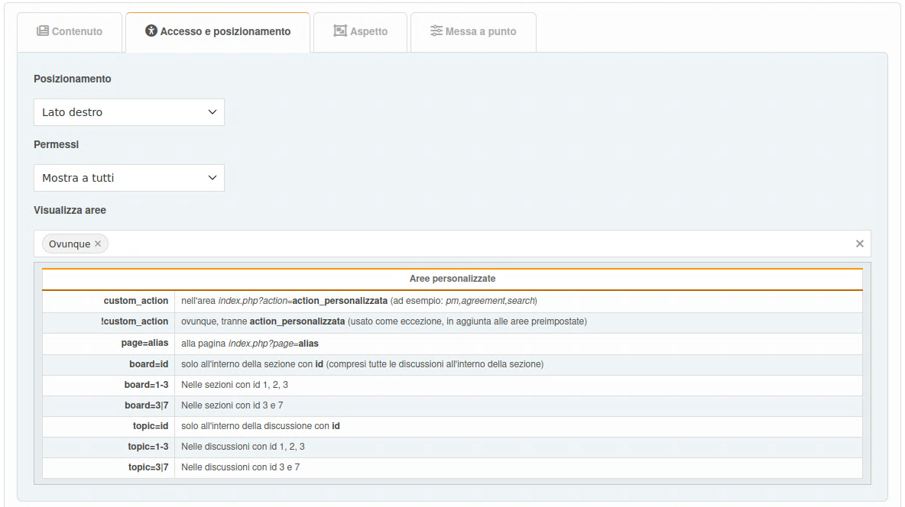
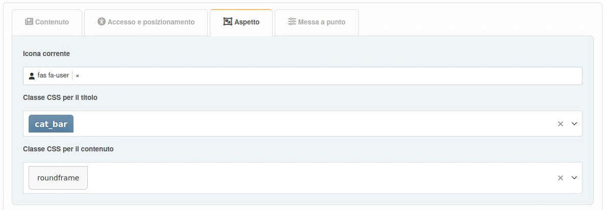
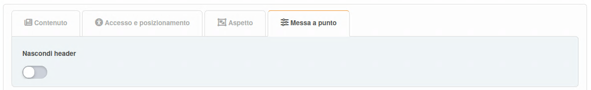

# Aggiungi Plugin

Per aggiungere un blocco, fai clic su di esso. Inizialmente, è possibile creare blocchi di tre tipi: PHP, HTML e BBCode. Se hai vuoi altri, [abilita i plugin necessari] (../plugins/manage) di tipo `blocco`.

A seconda del tipo di blocco saranno disponibili diverse impostazioni, suddivise in diverse schede.

## Tipi di blocco

### Tipi di contenuto incorporati

- **BBC**: Abilita il BBCode per il contenuto
- **HTML**: Contenuto raw HTML
- **PHP**: Codice PHP eseguibile (solo per gli amministratori)

### Blocchi basati su plugin

I blocchi dei plugin estendono la funzionalità. Esempi:

- **Markdown**: Abilitata Markdown per il contenuto
- **ArticleList**: Visualizza articolo da una discussione/pagina con settaggi di visualizzazione configurabili
- **Calculator**: Widget di una calcolatrice interattiva
- **BoardStats**: Statistiche del forum
- **News**: Ultimi annunci
- **Polls**: Sondaggi del forum attivi
- **RecentPosts**: Attività recenti del forum
- **UserInfo**: Dettaglio dell'utente corrente
- **WhosOnline**: Lista degli utenti online

## Scheda contenuto

Qui puoi configurare:

- title
- note
- contenuto (solo per alcuni blocchi)

## Scheda accesso e posizionamento

Qui puoi configurare:

- posizionamento
- permessi
- aree di visualizzazione

## Scheda Aspetto

Qui è possibile configurare le opzioni di aspetto del blocco.

## Messa a punto

Miglioramenti specifici del blocco sono generalmente disponibili nella scheda **Messa a punto**.

I plugin possono aggiungere le proprie personalizzazioni a ciascuna di queste sezioni, a seconda delle intenzioni degli sviluppatori.
