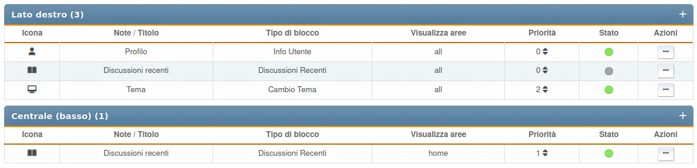

# Gestisci blocchi

Questa sezione elenca tutti i blocchi del portale configurati, sia abilitati che disabilitati. I blocchi sono ordinati per pannello.

Per ogni blocco vengono visualizzati l'icona, la nota o il titolo, la tipologia, le aree di visualizzazione, la priorità e l'elenco delle azioni.

Per ciascuna pagina sono disponibili le seguenti azioni:

- Ordinamento - all'interno di ciascun pannello è possibile impostare un ordine per i blocchi
- Pulsante stato (abilitato o disabilitato)
- Clona - creazione di un nuovo blocco basato su quello corrente
- Modifica - cambia le impostazioni per questa specifica pagina
- Elimina
