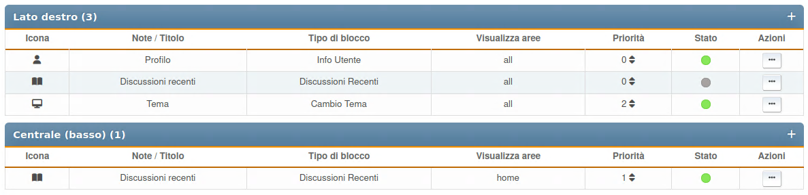

# Gestisci blocchi

Questa sezione mostra tutti i blocchi del portale che sono configurati, sia che siano abilitati o disabilitati. I blocchi sono ordinati per pannello.

Per ogni blocco, puoi vedere la sua icona, il titolo o la descrizione, il tipo, il pannello, la priorità e un elenco di azioni disponibili.

Per ciascuna pagina sono disponibili le seguenti azioni:

- Ordinamento - all'interno di ciascun pannello è possibile impostare un ordine per i blocchi
- Pulsante stato (abilitato o disabilitato)
- Clona - creazione di un nuovo blocco basato su quello corrente
- Modifica - cambia le impostazioni per questo specifico blocco
- Elimina
