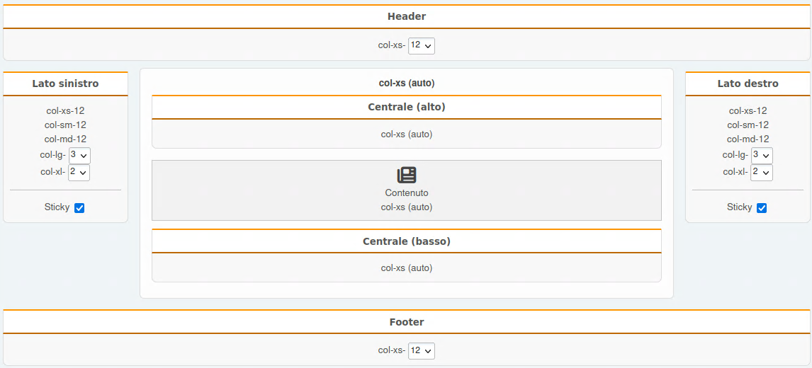

# Impostazioni Portale

Utilizza l'accesso rapido tramite la voce nel menu principale del forum o la sezione corrispondente nel pannello di amministrazione per aprire le impostazioni del portale.

Non verranno descritte nel dettaglio ciascuna delle impostazioni disponibili, verranno citate solo quelle più importanti. In caso di dubbi su alcuni parametri, contatta lo sviluppatore tramite l'area [Suggerimenti](#feedback).

## Impostazioni generali

In questa sezione è possibile personalizzare completamente la pagina iniziale del portale (frontpage), abilitare la modalità standalone e modificare le autorizzazioni utenti per accedere agli elementi del portale.

### Impostazioni per frontpage e articoli

Per modificare il contenuto della home page del portale, selezionare la desiderata modalità "frontage":

- Disabilitato
- Pagina specifica (verrà visualizzata solo la pagina selezionata)
- Tutte le pagine da una categoria selezionata
- Pagine selezionate
- Tutte le discussioni da sezioni selezionate
- Discussioni selezionate
- Sezioni selezionate

### Modalità Standalone

Questa è una modalità in cui puoi specificare la tua home page (anche se si trova su un altro sito) e rimuovere voci non necessarie dal menu principale (utenti, calendario, ecc.). Vedi ad esempio il file `portal.php` nella root del forum.

### Permessi

Qui riporti semplicemente CHI può e COSA può fare con i vari elementi (blocchi e pagine) del portale.

## Pagine e blocchi

In questa sezione puoi modificare le impostazioni generali delle pagine e dei blocchi utilizzati, sia in fase di creazione che in fase di visualizzazione.

## Categorie

In questa sezione è possibile gestire le categorie per classificare le pagine del portale. Se ne hai bisogno, ovviamente.

## Pannelli

In questa sezione puoi modificare alcune impostazioni per i pannelli del portale e personalizzare la direzione dei blocchi.

## Varie

In questa sezione puoi modificare varie impostazioni ausiliarie del portale, che potrebbero essere utili agli sviluppatori di template e plugin.

### Modalità di compatibilità

- Il valore del parametro **action** del portale - ​puoi modificare questo valore per utilizzare Light Portal insieme ad altre modifiche simili e non avere conflitti.
  ​ Quindi si aprirà la home page all'indirizzo specificato.
- Il valore del parametro **page** per le pagine del portale - vedi sopra. Allo stesso modo, per le pagine del portale - modifica il valore e si apriranno con URL differenti.

### Manutenzione

- Ottimizzazione settimanale delle tabelle del portale - abilita questa opzione in modo che una volta alla settimana le righe con valori vuoti nelle tabelle del portale nel database vengano eliminate e le tabelle vengano ottimizzate.

## Suggerimenti

Qui puoi contattare lo sviluppatore del portale. Puoi inviare la tua domanda direttamente senza registrarti sui forum o su Github. Assicurati di includere una mail valida se desideri ricevere una risposta.
