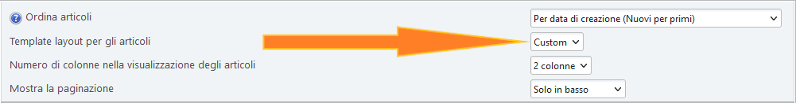

# Creare il proprio layout per il frontpage

:::info Nota

Dalla versione 2.6. viene utilizzato [BladeOne](https://github.com/EFTEC/BladeOne) per eseguire il rendering dei layout del frontpage.

:::

Oltre ai layout esistenti, puoi sempre aggiungerne di tuoi.

Per farlo, crea un file `custom.blade.php` nella cartella `/Themes/default/portal_layouts`:

```php:line-numbers {6,16}
@extends('partials.base')

@section('content')
	<!-- <div> @dump($context['user']) </div> -->

	<div class="lp_frontpage_articles article_custom">
		@include('partials.pagination')

		@foreach ($context['lp_frontpage_articles'] as $article)
		<div class="
			col-xs-12 col-sm-6 col-md-4
			col-lg-{{ $context['lp_frontpage_num_columns'] }}
			col-xl-{{ $context['lp_frontpage_num_columns'] }}
		">
			<figure class="noticebox">
				{!! parse_bbc('[code]' . print_r($article, true) . '[/code]') !!}
			</figure>
		</div>
		@endforeach

		@include('partials.pagination', ['position' => 'bottom'])
	</div>
@endsection
```

Successivamente vedrai un nuovo layout del frontpage - "Custom" - nelle impostazioni del portale:



Puoi creare tutti i layout che desideri. Utilizza `debug.blade.php` e altri layout nella cartella `/Themes/default/LightPortal/layouts` come esempi.

Per personalizzare i fogli di stile, crea un file `portal_custom.css` nella cartella `/Themes/default/css`:

```css {3}
/* Custom layout */
.article_custom {
  /* Your rules */
}
```

:::tip Suggerimento

Se hai creato il tuo modello del frontpage e desideri condividerlo con lo sviluppatore ed altri utenti, utilizza https://codepen.io/pen/ o altre risorse simili.

:::
