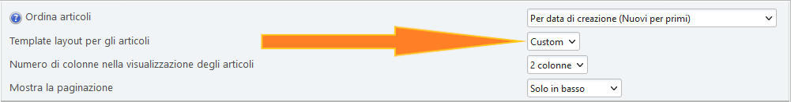

# Crea layout personalizzati

Light Portal utilizza un sistema di modelli flessibile basato su [BladeOne] (https://github.com/EFTEC/BladeOne), un'implementazione standalone del motore di modellazione Blade di Laravel. Questo sistema ti consente di personalizzare l'aspetto e la struttura del tuo portale attraverso layout, temi e componenti riutilizzabili.

## Sistema del template

### Motore del template di Blade

Blade è un potente motore di modellazione che fornisce una sintassi pulita e leggibile per mescolare PHP con HTML. Funzionalità chiave:

- **Ereditarietà template**: utilizza le direttive `@extends` e `@section` per creare gerarchie di layout
- **Inclusioni**: Riutilizzare i componenti con le direttive `@include`
- **Controllo della struttura**: sintassi simile a PHP con `@if`, `@foreach`, `@while`, ecc.

Puoi vedere informazioni dettagliate sul markup Blade [qui](https://github.com/EFTEC/BladeOne/wiki/Template-variables).

### Layouts

I layout definiscono la struttura generale della tua prima pagina. Situato in `/Themes/default/LightPortal/layouts/`, determinano come sono disposti gli articoli in prima pagina. Ad esempio:

- `default.blade.php` - Layout standard della griglia
- `simple.blade.php` - Design minimalista
- `modern.blade.php` - Stile contemporaneo
- `featured_grid.blade.php` - Griglia di contenuto evidenziata

### Parziali

Componenti di template riutilizzabili salvati in `/Themes/default/LightPortal/layouts/partials/`:

- `base.blade.php` - wrapper del layout principale
- `card.blade.php` - Modello della scheda dell'articolo
- `pagination.blade.php` - Navigazione della pagina
- `image.blade.php` - Componente di visualizzazione dell'immagine

### Temi e risorse

- `/Themes/default/LightPortal`: File del template del portale
- `/languages/LightPortal`: File di localizzazione
- `/css/light_portal`: Miglioramenti CSS
- `/css/light_portal`: Miglioramenti JavaScript

## Esempio layout

Oltre ai layout della prima pagina già esistenti, puoi sempre aggiungerne i tuoi.

Per farlo, crea un file `custom.blade.php` nella cartella `/Themes/default/portal_layouts`:

```php:line-numbers {6,16}
@extends('partials.base')

@section('content')
	<!-- <div> @dump($context['user']) </div> -->

	<div class="lp_frontpage_articles article_custom">
		@include('partials.pagination')

		@foreach ($context['lp_frontpage_articles'] as $article)
			<div class="
				col-xs-12 col-sm-6 col-md-4
				col-lg-{{ $context['lp_frontpage_num_columns'] }}
				col-xl-{{ $context['lp_frontpage_num_columns'] }}
			">
				<figure class="noticebox">
					{!! parse_bbc('[code]' . print_r($article, true) . '[/code]') !!}
				</figure>
			</div>
		@endforeach

		@include('partials.pagination', ['position' => 'bottom'])
	</div>
@endsection

<style>
.article_custom {
	// Your CSS
}
</style>
```

Dopo di che si vedrà un nuovo layout per la prima pagina - `Custom` - sulle impostazioni del portale:



Puoi creare tutti i layout che desideri. Utilizza `debug.blade.php` e altri layout nella cartella `/Themes/default/LightPortal/layouts` come esempi.

## Personalizzazione CSS

Puoi facilmente cambiare l'aspetto di qualsiasi cosa aggiungendo i tuoi stili. Basta creare un nuovo file chiamato `portal_custom.css` nella cartella `Themes/default/css` e mettere il CSS lì.

:::tip Suggerimento

Se hai creato il tuo modello di prima pagina e vuoi condividerlo con lo sviluppatore e altri utenti, utilizza https://codepen.io/pen/ o altre risorse simili.

:::
