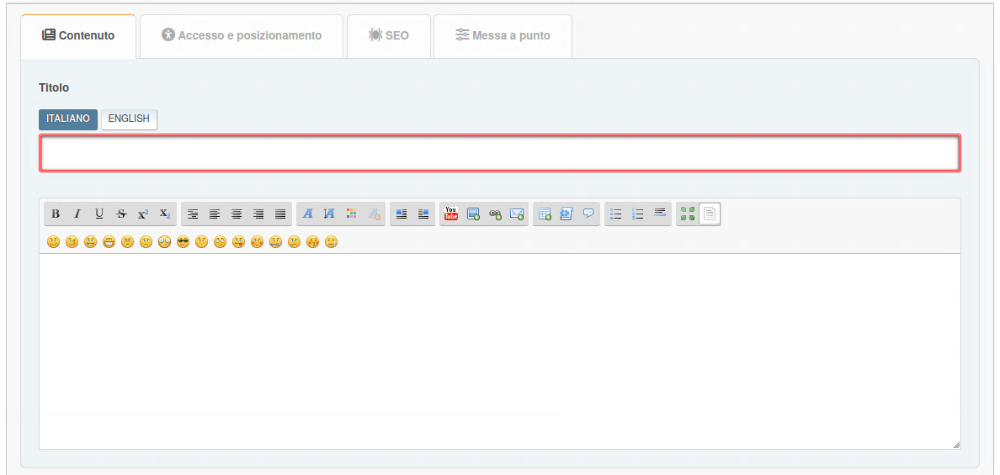
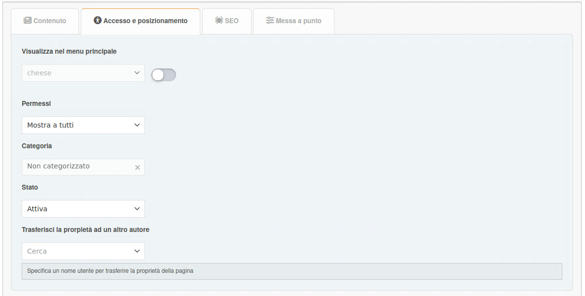
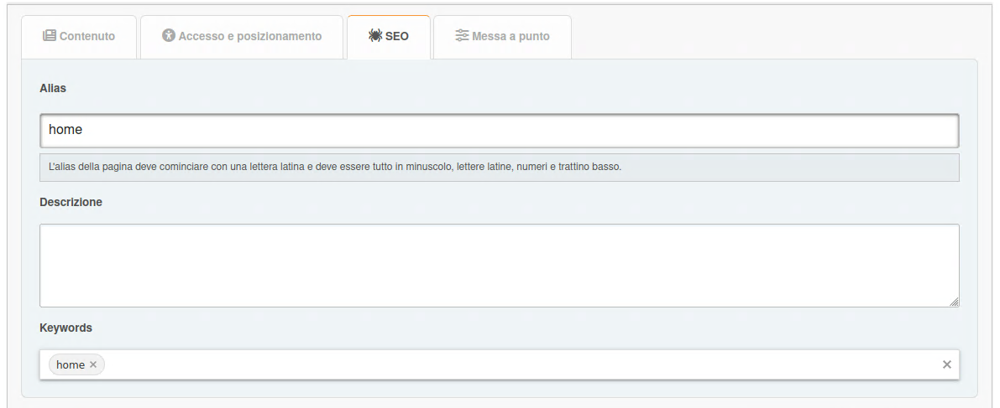
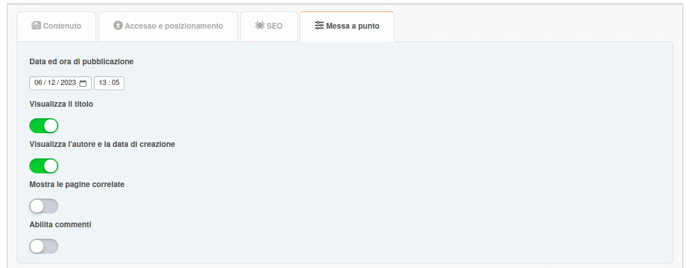

# Aggiungi pagina

In this section, you can create a portal page with the content you need.

## Page types

### Built-in content types

- **BBC**: Abilita il BBCode per il contenuto
- **HTML**: Contenuto raw HTML
- **PHP**: Codice PHP eseguibile (solo per gli amministratori)

### Blocchi basati su plugin

Plugins can extend the functionality by adding new page types or statuses. Esempi:

- **Markdown**: Abilitata Markdown per il contenuto
- **BlogMode**: Adds a new "Blog entry" type for displaying pages in a separate menu section

## Scheda contenuto

Qui puoi configurare:

- titolo
- contenuto

## Scheda accesso e posizionamento

Qui puoi configurare:

- status — inactive, active, or unapproved
- permessi — specifica chi può vedere questa pagina
- categoria — se ti piace mantenere le cose organizzate
- type — default, internal, or draft

## Scheda SEO

Qui puoi configurare:

- slug — è la parte dell'indirizzo (`?page=slug`)
- descrizione — Il meta description
- tags — verranno visualizzati come tag di pagina e meta keywords

## Messa a punto

Qui puoi configurare:

- data ed ora di pubblicazione — la pubblicazione della pagina può essere programmata
- visualizza il titolo — può essere disabilitato se hai la tua intestazione
- visualizza l'autore e la data di creazione
- mostra le pagine correlate
- commenti — puoi consentirli o negarli separatamente per ciascuna pagina

