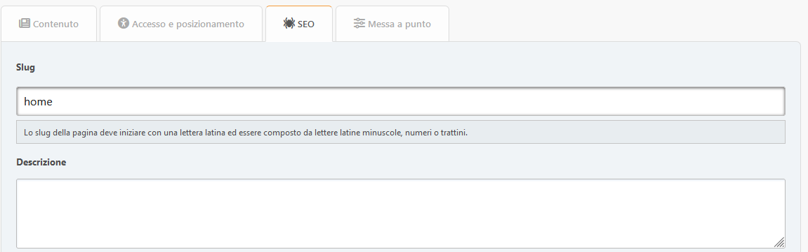

# Aggiungi pagina

In questa sezione puoi creare una pagina del portale con il contenuto di cui hai bisogno. I campi obbligatori sono evidenziati con una cornice colorata.

## Scheda contenuto

Qui puoi configurare:

- titolo
- tipi di pagina
- contenuto

## Scheda accesso e posizionamento

Qui puoi configurare:

- permessi — specifica chi può vedere questa pagina
- categoria — se ti piace mantenere le cose organizzate
- Trasferisci la proprietà ad un altro autore — se vuoi cambiare l'autore

## Scheda SEO

Qui puoi configurare:

- alias — la pagina sarà disponibile in `?page=alias`
- descrizione — Il meta description
- keywords — il meta keywords

## Messa a punto

Qui puoi configurare:

- data ed ora di pubblicazione — la pubblicazione della pagina può essere programmata
- visualizza il titolo — può essere disabilitato se hai la tua intestazione
- visualizza l'autore e la data di creazione
- mostra le pagine correlate
- commenti — puoi consentirli o negarli separatamente per ciascuna pagina

