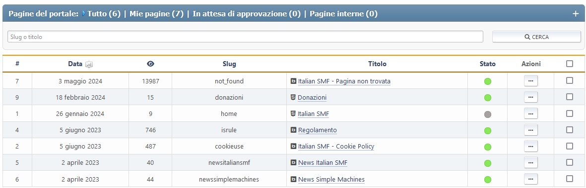

# Gestisci pagine

Questa sezione mostra tutte le pagine che hai creato che puoi modificare. Puoi cercarli con il loro titolo o slug.

Ogni pagina mostra il suo ID, la creazione o l'ultima data aggiornata, il conteggio delle visualizzazioni, il conteggio dei commenti, il tipo di pagina, lo slug e il titolo. Vedi anche un elenco di azioni che puoi fare con esso.

Per ciascuna pagina sono disponibili le seguenti azioni:

- Pulsante stato (abilitato o disabilitato)
- Modifica - cambia le impostazioni per questa specifica pagina
- Elimina

Sono disponibili anche azioni di massa.
