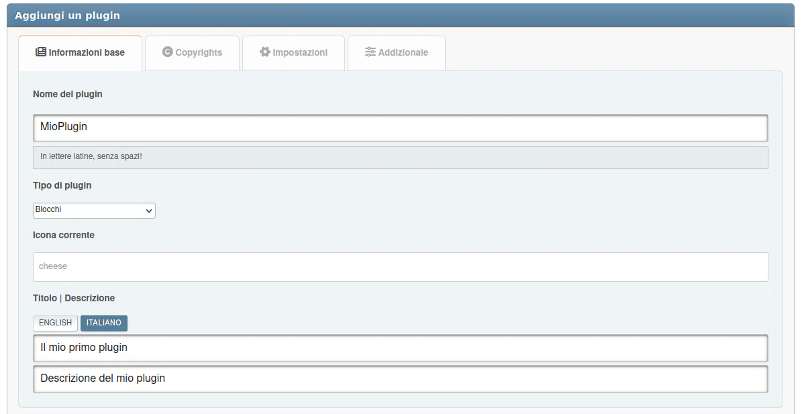

# Aggiungi Plugin

I plugin sono le estensioni che espandono le capacità del Light Portal. Per creare il tuo plugin, basta seguire le istruzioni seguenti.

## PluginType enum

Per una migliore sicurezza del tipo e supporto IDE, è possibile utilizzare l'enum `PluginType` invece dei valori delle stringhe per il parametro `type`:

```php
use LightPortal\Enums\PluginType;
use LightPortal\Plugins\PluginAttribute;

// Instead of: #[PluginAttribute(type: 'editor')]
#[PluginAttribute(type: PluginType::EDITOR)]

// Instead of: #[PluginAttribute(type: 'block')]
#[PluginAttribute(type: PluginType::BLOCK)]

// Instead of: #[PluginAttribute(type: 'other')]
#[PluginAttribute(type: PluginType::OTHER)]

// Or simply omit the type parameter since OTHER is default:
#[PluginAttribute]
```

Valori PluginType disponibili:

- `PluginType::ARTICLE` - Per l'elaborazione del contenuto dell'articolo
- `PluginType::BLOCK` - Per i blocchi
- `PluginType::BLOCK_OPTIONS` - Per le opzioni dei blocchi
- `PluginType::COMMENT` - Per il sistema dei commenti
- `PluginType::EDITOR` - Per gli editor
- `PluginType::FRONTPAGE` - Per la modifica del frontpage
- `PluginType::GAMES` - Per i giochi
- `PluginType::ICONS` - Per la libreria icone
- `PluginType::IMPEX` - Per l'importazione/esportazione
- `PluginType::OTHER` - Tipo predefinito (può essere omesso)
- `PluginType::PAGE_OPTIONS` - Per le opzioni delle pagine
- `PluginType::PARSER` - Per i parser
- `PluginType::SEO` - Per il SEO
- `PluginType::SSI` - Per i blocchi con funzioni SSI

Per i plugin che estendono le classi `Block`, `Editor`, `GameBlock`, o `SSIBlock`, il tipo viene ereditato automaticamente e non deve essere specificato esplicitamente.

:::info Note

Puoi utilizzare **PluginMaker** come assistente per creare i tuoi plugin. Scaricalo e abilitalo nella pagina _Amministrazione -> Portale -> Plugins_.



:::

## Scelta del tipo di plugin

Scelta del tipo di plugin

| Tipo                            |                                                                                                                               Descrizione |
| ------------------------------- | ----------------------------------------------------------------------------------------------------------------------------------------: |
| `block`                         |                                                               Plugin che aggiungono nuovi tipi di blocchi per il portale. |
| `ssi`                           |                       Plugin (solitamente blocchi) che utilizzano le funzioni SSI per recuperare dati. |
| `editor`                        |                                             Plugin che aggiungono un editor di terze parti per diversi tipi di contenuti. |
| `comment`                       |                                               Plugin che aggiungono un widget di terze parti invece del widget integrato. |
| `parser`                        |                                                      Plugin che implementano l'analisi del contenuto di pagine e blocchi. |
| `article`                       |                              Plugin per l'elaborazione del contenuto delle schede degli articoli nella pagina principale. |
| `frontpage`                     |                                                                   Plugin per modificare la pagina principale del portale. |
| `impex`                         |                                                              Plugin per importare ed esportare vari elementi del portale. |
| `block_options`, `page_options` |              Plugin che aggiungono parametri aggiuntivi per l'entità corrispondente (blocco o pagina). |
| `icons`                         | Plugin che aggiungono nuove librerie di icone per sostituire gli elementi dell'interfaccia o da utilizzare nelle intestazioni dei blocchi |
| `seo`                           |                                                   Plugin che in qualche modo influenzano la visibilità del forum in rete. |
| `other`                         |                                                   Plugin che non sono correlati a nessuna delle categorie sopra indicate. |
| `games`                         |                                                      Plugin che in genere aggiungono un blocco con qualche tipo di gioco. |

## Creazione della cartella del plugin

Crea una cartella separata per i file dei plugin, all'interno di `/Sources/LightPortal/Plugins`. Ad esempio, se il tuo plugin si chiama "HelloWorld", la struttura delle cartelle dovrebbe assomigliare a questa:

```
...(Plugins)
└── HelloWorld/
    ├── langs/
    │   ├── english.php
    │   └── index.php
    ├── index.php
    └── HelloWorld.php
```

Il file `index.php` può essere copiato da cartelle di altri plugin. Il file `HelloWorld.php` contiene la logica del plugin:

```php:line-numbers {16}
<?php declare(strict_types=1);

namespace LightPortal\Plugins\HelloWorld;

use LightPortal\Plugins\Plugin;
use LightPortal\Plugins\PluginAttribute;

if (! defined('LP_NAME'))
    die('No direct access...');

#[PluginAttribute(icon: 'fas fa-globe')]
class HelloWorld extends Plugin
{
    public function init(): void
    {
        echo 'Hello world!';
    }

    // Other hooks and custom methods
}

```

## SSI

Se il plugin deve recuperare dati utilizzando le funzioni SSI, utilizzare il metodo integrato `getFromSsi(string $function, ...$params)`. Come parametro `$function` bisogna passare il nome di una delle funzioni contenute nel file **SSI.php**, senza prefisso `ssi_`. Ad esempio:

```php:line-numbers {17}
<?php declare(strict_types=1);

namespace LightPortal\Plugins\TopTopics;

use LightPortal\Plugins\Event;
use LightPortal\Plugins\PluginAttribute;
use LightPortal\Plugins\SsiBlock;

if (! defined('LP_NAME'))
    die('No direct access...');

#[PluginAttribute(icon: 'fas fa-star')]
class TopTopics extends SsiBlock
{
    public function prepareContent(Event $e): void
    {
        $data = $this->getFromSSI('topTopics', 'views', 10, 'array');

        if ($data) {
            var_dump($data);
        } else {
            echo '<p>No top topics found.</p>';
        }
    }
}
```

## Template Blade

Il plugin può utilizzare un template con il markup Blade. Ad esempio:

```php:line-numbers {16,20}
<?php declare(strict_types=1);

namespace LightPortal\Plugins\Calculator;

use LightPortal\Plugins\Event;
use LightPortal\Plugins\PluginAttribute;
use LightPortal\Plugins\Block;
use LightPortal\Utils\Traits\HasView;

if (! defined('LP_NAME'))
    die('No direct access...');

#[PluginAttribute(icon: 'fas fa-calculator')]
class Calculator extends Block
{
    use HasView;

    public function prepareContent(Event $e): void
    {
        echo $this->view(params: ['id' => $e->args->id]);
    }
}
```

**Istruzioni:**

1. Crea la sottodirectory `views` all'interno della directory del plugin se non esiste.
2. Creare il file `default.blade.php` con il seguente contenuto:

```blade
<div class="some-class-{{ $id }}">
    {{-- Il tuo markup blade  --}}
</div>

<style>
// il tuo CSS
</style>

<script>
// il tuo JS
</script>
```

## Composer

Il tuo plugin può utilizzare librerie di terze parti installate tramite Composer. Assicurati che il file `composer.json`, che contiene le dipendenze necessarie, si trovi nella cartella del plugin. Prima di pubblicare il tuo plugin, apri la cartella dei plugin con il terminale ed esegui il comando: `composer install --no-dev -o`. Successivamente, l'intero contenuto della cartella dei plugin può essere impacchettato come una modifica separata per SMF (vedi ad esempio il pacchetto **PluginMaker**).

Ad esempio:

::: code-group

```php:line-numbers {15} [CarbonDate.php]
<?php declare(strict_types=1);

namespace LightPortal\Plugins\CarbonDate;

use Carbon\Carbon;
use LightPortal\Plugins\Plugin;

if (! defined('LP_NAME'))
    die('No direct access...');

class CarbonDate extends Plugin
{
    public function init(): void
    {
        require_once __DIR__ . '/vendor/autoload.php';

        $date = Carbon::now()->format('l, F j, Y \a\t g:i A');

        echo 'Current date and time: ' . $date;
    }
}
```

```json [composer.json]
{
    "require": {
      "nesbot/carbon": "^3.0"
    },
    "config": {
      "optimize-autoloader": true
    }
}
```

:::
