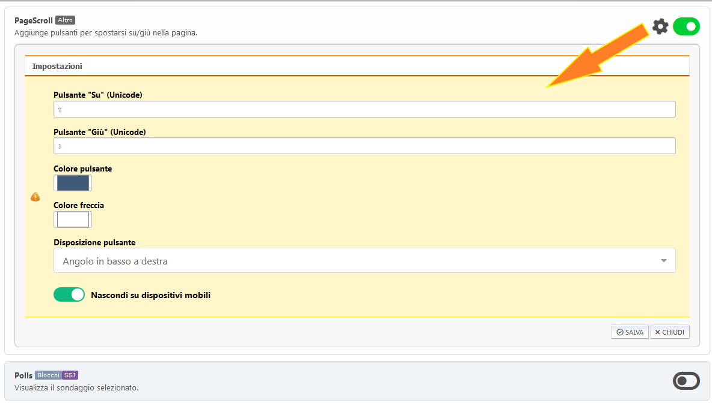
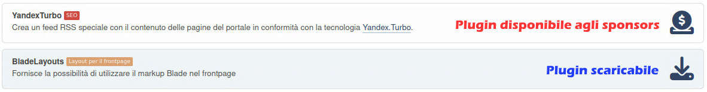

# Gestisci plugins

Tutti i plugin installati sono elencati qui. Alcuni di loro hanno le proprie impostazioni.

Se lo desideri, puoi alternare la visualizzazione dei plugin in 1 colonna (impostazione predefinita) o in 2 colonne.

Se desideri modificare le impostazioni del plugin, fai clic sull'ingranaggio accanto al pulsante di attivazione/disattivazione del plugin.

## Installazione di plugin aggiuntivi

Alcuni plugin non sono inclusi nel portale, devono essere installati separatamente. Tali plugin si dividono in scaricabili oppure bonus a disposizione degli sponsor del progetto.

The separate plugin package can be installed in the Plugin Import section. Ma puoi anche semplicemente estrarre la cartella del plugin dall'archivio scaricato e spostarla nella cartella "Sources/LightPortal/Plugins".
