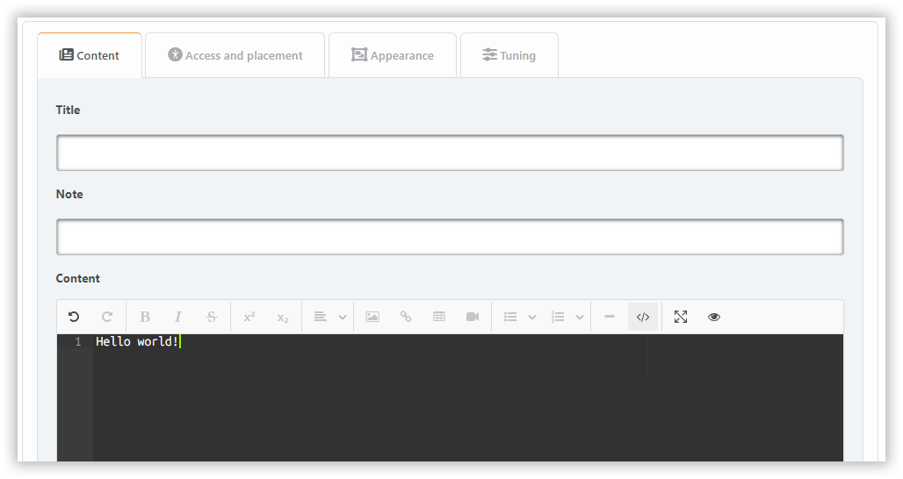

# Plug-in toevoegen

Om een blok toe te voegen, klik er eenvoudig op. In het begin kun je blokken van drie types maken: PHP, HTML en BBCode. Als je andere nodig hebt, schakel dan [eerst de benodigde plugins](../plugins/manage) van het type `block` in.

Afhankelijk van het bloktype zijn verschillende instellingen beschikbaar, verspreid over verschillende tabbladen.

## Block types

### Built-in content types

- **BBC**: Allows BBCode markup for content
- **HTML**: Raw HTML content
- **PHP**: Executable PHP code (admin only)

### Plugin-based blocks

Blocks from plugins extend functionality. Examples:

- **Markdown**: Enables Markdown syntax for content
- **ArticleList**: Displays articles from topics/pages with customizable display options
- **Calculator**: Interactive calculator widget
- **BoardStats**: Forum board statistics
- **News**: Latest announcements
- **Polls**: Active forum polls
- **RecentPosts**: Recent forum activity
- **UserInfo**: Current user details
- **WhosOnline**: Online users list

## Content tab

Hier kunt u configureren:

- title
- note
- inhoud (alleen voor sommige blokken)

## Toegang en plaatsing tabblad

Hier kunt u configureren:

- plaatsing
- permissies
- gebieden

## Weergave tabblad

Here you can configure the block appearance options.

## Tuning tab

Block-specifieke tuners zijn meestal beschikbaar op het **Tuning** tabblad.

Plugins kunnen hun eigen aanpassingen toevoegen aan een van deze secties, afhankelijk van de bedoelingen van ontwikkelaars.
