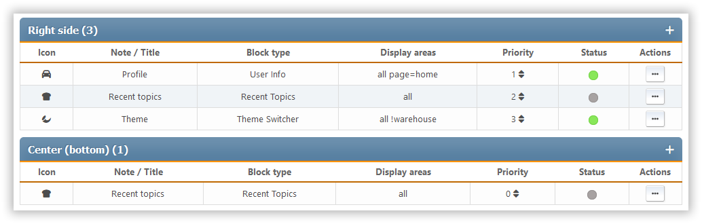

# Beheer blokken

This section shows all the portal blocks that are set up, whether they're enabled or disabled. The blocks are sorted by panel.

For each block, we see its icon, description or title, the type, where the output goes, how important it is, and a list of actions that can be done with it.

De volgende acties zijn voor elke pagina beschikbaar:

- Wijziging van prioriteit - binnen elk paneel kunt u een individuele volgorde van blokken instellen
- Status in-/uitschakelen (inschakelen of uitschakelen)
- Kopieer - maak een nieuw blok aan dat de huidige
- Bewerken - wijzig de instellingen van een specifiek blok
- Verwijderen
