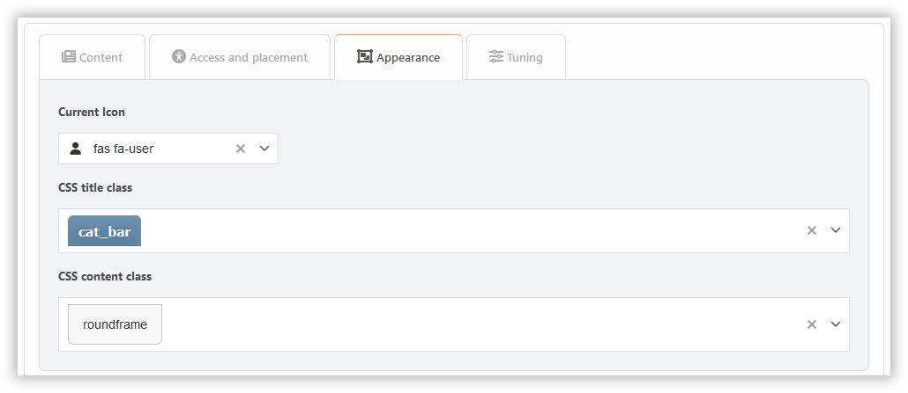

# Dodaj wtyczkę

Aby dodać blok, po prostu kliknij. Na początku możesz tworzyć bloki trzech typów: PHP, HTML i BBCode. Jeśli potrzebujesz innych, najpierw [włącz niezbędne wtyczki](../plugins/manage) typu `block`.

W zależności od typu bloku dostępne będą różne ustawienia, rozprzestrzeniane na różne karty.

## Block types

### Built-in content types

- **BBC**: Allows BBCode markup for content
- **HTML**: Raw HTML content
- **PHP**: Executable PHP code (admin only)

### Plugin-based blocks

Blocks from plugins extend functionality. Examples:

- **Markdown**: Enables Markdown syntax for content
- **ArticleList**: Displays articles from topics/pages with customizable display options
- **Calculator**: Interactive calculator widget
- **BoardStats**: Forum board statistics
- **News**: Latest announcements
- **Polls**: Active forum polls
- **RecentPosts**: Recent forum activity
- **UserInfo**: Current user details
- **WhosOnline**: Online users list

## Karta zawartości

Tutaj możesz skonfigurować:

- title
- note
- zawartość (tylko dla niektórych bloków)

## Karta dostępu i rozmieszczenia

Tutaj możesz skonfigurować:

- umieść
- uprawnienia
- obszary

## Karta wyglądu

Here you can configure the block appearance options.

## Karta tuning

Tunery specyficzne dla bloku są zazwyczaj dostępne na karcie **Tuning**.

Wtyczki mogą dodawać własne dostosowania do każdej z tych sekcji, w zależności od intencji programistów.
