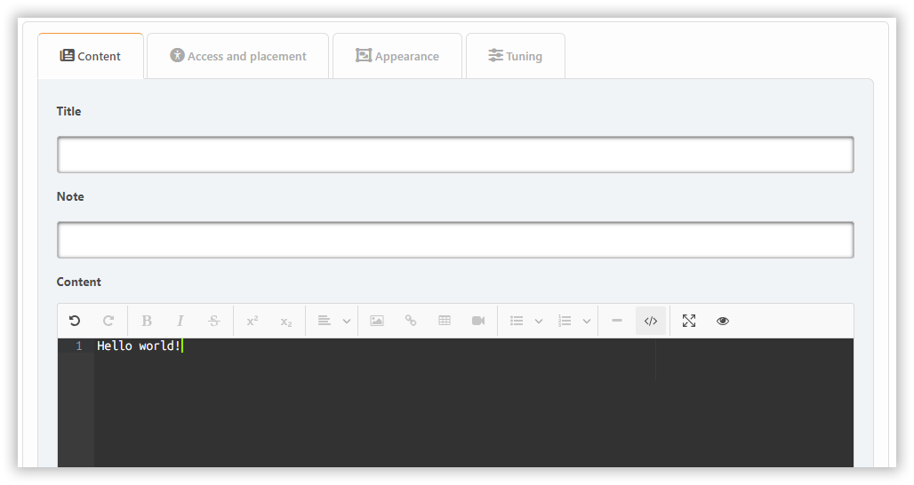
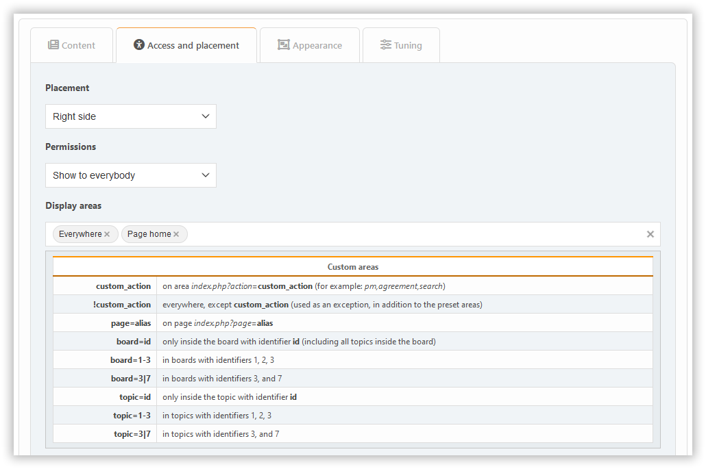
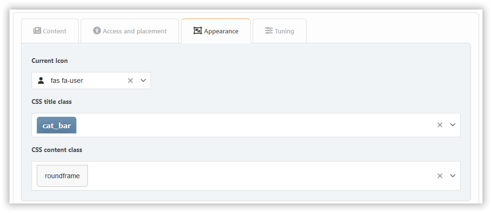
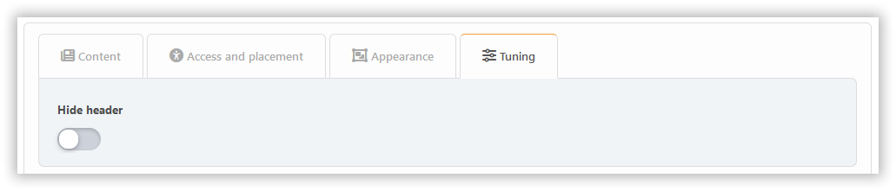

# Dodaj wtyczkę

Aby dodać blok, po prostu kliknij. Na początku możesz tworzyć bloki trzech typów: PHP, HTML i BBCode. Jeśli potrzebujesz innych, najpierw [włącz niezbędne wtyczki](../plugins/manage) typu `block`.

W zależności od typu bloku dostępne będą różne ustawienia, rozprzestrzeniane na różne karty.

## Typy bloków

### Wbudowane typy treści

- **BBC**: Umożliwia stosowanie znaczników BBCode w treści
- **HTML**: Nieprzetworzona treść HTML
- **PHP**: Kod PHP do wykonania (tylko dla administratorów)

### Bloki oparte na wtyczkach

Bloki ze wtyczek rozszerzają funkcjonalność. Przykłady:

- **Markdown**: Włącza obsługę składni Markdown dla treści
- **ArticleList**: Wyświetla artykuły z kategorii/stron z możliwością dostosowania opcji wyświetlania
- **Kalkulator**: Interaktywny widget kalkulatora
- **Statystyki**: Statystyki forum
- **Aktualności**: Najnowsze komunikaty
- **Ankiety**: Aktywne ankiety na forum
- **Najnowsze posty**: Najnowsze wpisy na forum
- **Informacje o użytkowniku**: Dane aktualnego użytkownika
- **Kto jest online**: Lista użytkowników online

## Karta zawartości

Tutaj możesz skonfigurować:

- title
- note
- zawartość (tylko dla niektórych bloków)

## Karta dostępu i rozmieszczenia

Tutaj możesz skonfigurować:

- umieść
- uprawnienia
- obszary

## Karta wyglądu

W tym miejscu można skonfigurować opcje wyglądu bloku.

## Karta tuning

Tunery specyficzne dla bloku są zazwyczaj dostępne na karcie **Tuning**.

Wtyczki mogą dodawać własne dostosowania do każdej z tych sekcji, w zależności od intencji programistów.
