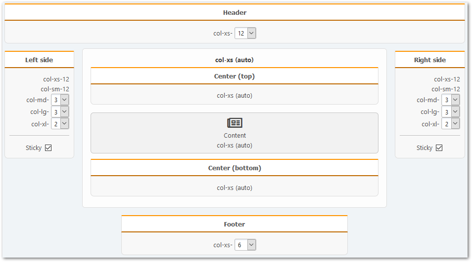

# Ustawienia portalu

Użyj szybkiego dostępu przez element w głównym menu forum lub odpowiedniej sekcji w panelu administratora, aby otworzyć ustawienia portalu.

Nie opiszemy szczegółowo każdego z dostępnych ustawień, wymienimy tylko te najważniejsze.

## Ustawienia ogólne

W tej sekcji możesz w pełni dostosować stronę główną portalu, włączyć tryb samodzielny i zmienić uprawnienia użytkownika w celu uzyskania dostępu do elementów portalu.

### Ustawienia strony głównej i artykułów

Aby zmienić zawartość strony głównej portalu, wybierz odpowiedni tryb "strona główna":

- Wyłącz
- Określona strona (tylko wybrana strona będzie wyświetlana)
- Wszystkie strony z wybranych kategorii
- Wybrane strony
- Wszystkie wątki z wybranych działów
- Wybrane wątki
- Wybrane działy

### Tryb autonomiczny

W tym trybie możesz określić własną stronę główną i usunąć niepotrzebne elementy z menu głównego (listy użytkowników, kalendarza itp.). Na przykład zobacz `portal.php` w katalogu głównym forum.

### Uprawnienia

Tutaj po prostu zauważysz, że WHO może i co może zrobić z różnymi elementami (blokami i stronami) portalu.

## Strony i bloki

W tej sekcji można zmienić ogólne ustawienia stron i bloków używanych zarówno podczas ich tworzenia, jak i wyświetlania.

## Panele

W tej sekcji możesz zmienić niektóre ustawienia istniejących paneli portalowych i dostosować kierunek bloków w tych panelach.

## Inne

W tej sekcji możesz zmienić różne ustawienia pomocnicze portalu, które mogą być przydatne dla twórców szablonów i wtyczek.

### Tryb kompatybilności

- Wartość parametru **akcji** portalu, można zmienić to ustawienie na Portal Światła w połączeniu z innymi podobnymi modyfikacjami. Następnie strona główna zostanie otwarta pod podanym adres.
- Parametr **strony** dla stron portalu, patrz powyżej. Podobnie, dla stron portalowych, zmień parametr i otworzą się za pomocą różnych adresów URL.

### Konserwacja

- Tygodniowa optymalizacja tabel portalu, włącz tę opcję, aby raz w tygodniu wiersze z pustymi wartościami w tabelach portalu w bazie danych zostały usunięte i tabele zostaną zoptymalizowane.
