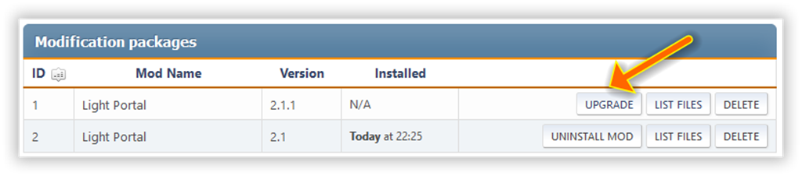

# Aktualizacja

Jeśli lista zmian nie zawiera konkretnych instrukcji dotyczących aktualizacji do najnowszej wersji, aktualizację można przeprowadzić, rozpakowując katalogi `Themes` i `Sources` do katalogu głównego forum, nadpisując istniejące pliki.

Jednak w celu przeprowadzenia czystej instalacji zalecamy najpierw odinstalować obecną wersję.

:::info Uwaga

Jeśli nową wersję można zainstalować bez usuwania poprzedniej, zamiast przycisku „Zainstaluj” pojawi się przycisk „Aktualizuj”:

:::
