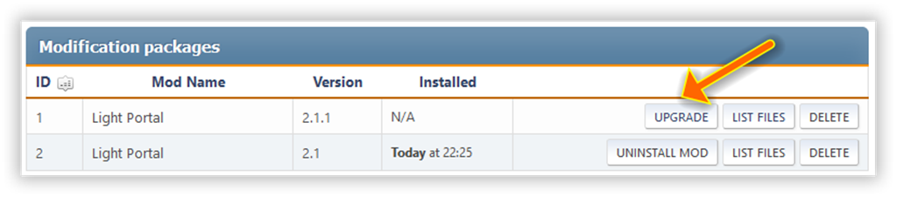

# Aktualizacja

Jeśli nie ma notatek w dzienniku zmian najnowszej wersji, wystarczy, aby wyodrębnić katalogi Themes i Sources z archiwum modyfikacji do katalogu głównego forum, ponad istniejącymi i aktualizacja będzie poprawna. Najlepiej jednak odinstalować bieżącą wersję przed zainstalowaniem nowej wersji.

:::info Notatka

Jeśli nową wersję można zainstalować bez usuwania poprzedniej, zamiast przycisku "Instaluj" użyj przycisku "Uaktualnij":

:::
