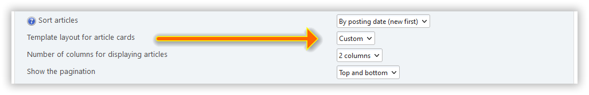

# Utwórz własny układ strony głównej

:::info Notatka

Od wersji 2.6 używamy [BladeOne](https://github.com/EFTEC/BladeOne) do renderowania układów strony głównej.

:::

Oprócz istniejących układów, zawsze możesz dodać własne.

Aby to zrobić, utwórz plik `custom.blade.php` w katalogu `/Themes/default/portal_layouts`:

```php:line-numbers {9}
@empty ($context['lp_active_blocks'])
<div class="col-xs">
@endempty
	<!-- <div> @dump($context['user']) </div> -->

	<div class="lp_frontpage_articles article_custom">
		{{ show_pagination() }}

		@foreach ($context['lp_frontpage_articles'] as $article)
		<div class="
			col-xs-12 col-sm-6 col-md-4
			col-lg-{{ $context['lp_frontpage_num_columns'] }}
			col-xl-{{ $context['lp_frontpage_num_columns'] }}
		">
			<figure class="noticebox">
				{!! parse_bbc('[code]' . print_r($article, true) . '[/code]') !!}
			</figure>
		</div>
		@endforeach

		{{ show_pagination('bottom') }}
	</div>

@empty ($context['lp_active_blocks'])
</div>
@endempty
```

Następnie zobaczysz nowy układ strony głównej - `Własny` - w ustawieniach portalu:



Możesz stworzyć tyle takich układów, ile chcesz. Użyj `debug.blade.php` i innych układów w katalogu `/Themes/default/LightPortal/layouts` jako przykładów.

Aby dostosować arkusz stylów, utwórz plik `portal_custom.css` w katalogu `/Themes/default/css`:

```css {3}
/* Custom layout */
.article_custom {
  /* Your rules */
}
```

:::tip Porada

Jeśli utworzyłeś własny szablon strony głównej i chcesz udostępnić go programistowi i innym użytkownikom, użyj https://codepen.io/pen/ lub innych podobnych zasobów.

:::
