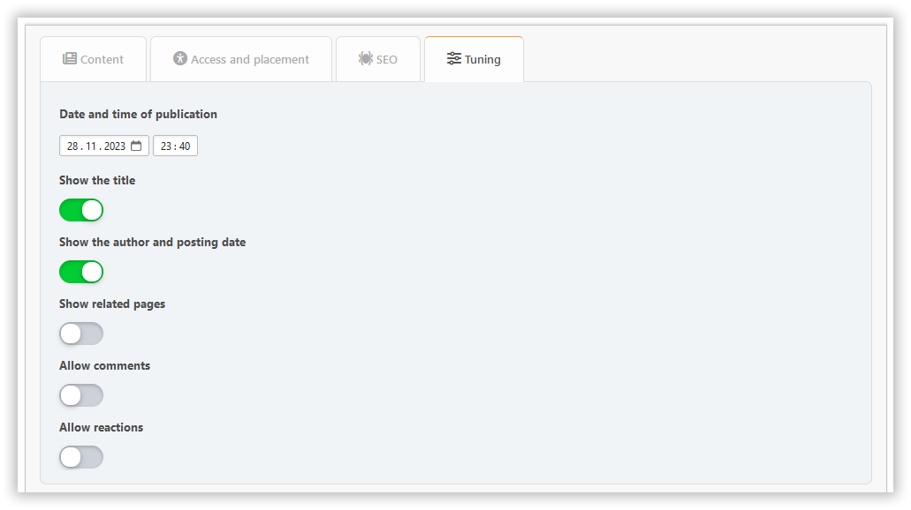

# Dodaj stronę

W tej sekcji możesz utworzyć stronę portalu z potrzebną treścią. Wymagane pola są zaznaczone kolorową ramką.

## Content tab

Tutaj możesz skonfigurować:

- tytuł
- typ strony
- zawartość

## Karta dostępu i rozmieszczenia

Tutaj możesz skonfigurować:

- uprawnienia — określ kto uzyska dostęp do Twojej strony
- kategoria — jeśli chcesz, aby rzeczy były zorganizowane
- przekaz autorstwa - jeśli chcesz zmienić autora

## SEO tab

Tutaj możesz skonfigurować:

- slug - jest częścią adresu URL strony (`?page=slug`)
- opis – opis meta
- tagi — będą wyświetlane jako znaczniki strony i słowa kluczowe meta

## Tuning tab

Tutaj możesz skonfigurować:

- data i godzina publikacji – strona może zostać opublikowana na harmonogramie
- wyświetlanie tytułu — może być wyłączone, jeśli masz własny nagłówek na stronie
- wyświetl autora i datę utworzenia
- wyświetl powiązane strony
- komentarze — możesz zezwolić lub odmówić ich oddzielnie dla każdej strony

