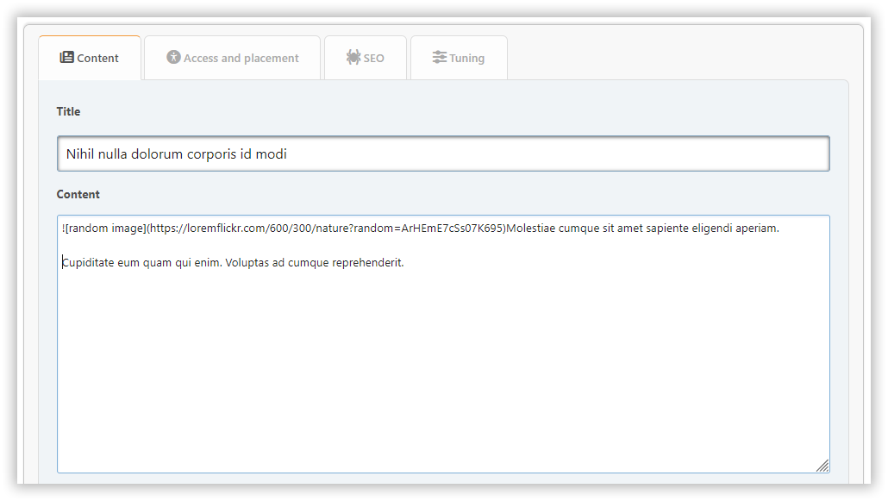
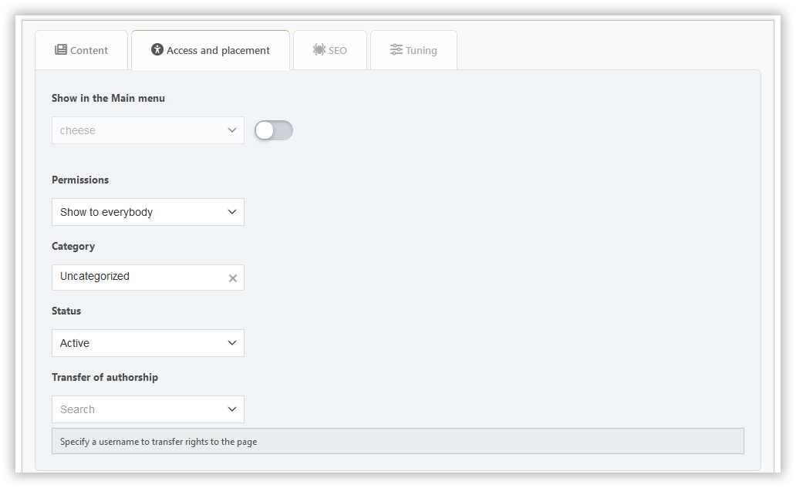
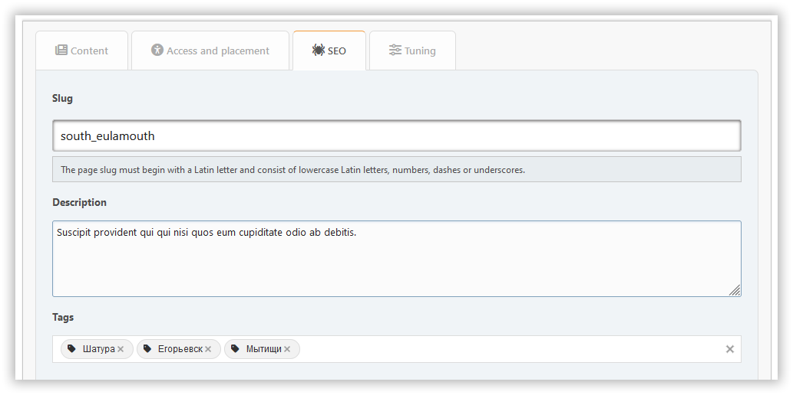
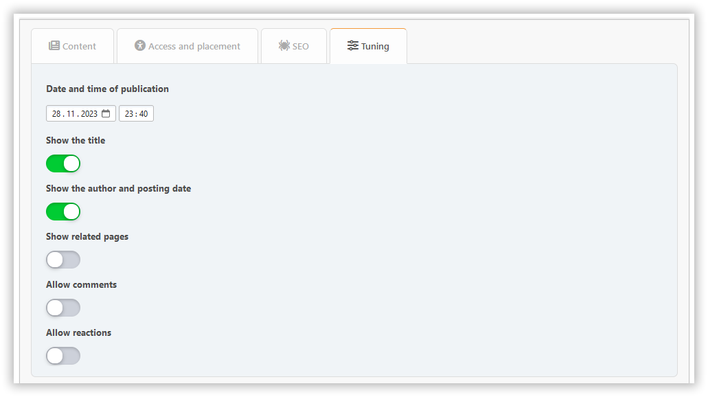

# Dodaj stronę

W tej sekcji możesz utworzyć stronę portalu zawierającą potrzebne treści.

## Typy stron

### Wbudowane typy treści

- **BBC**: Umożliwia stosowanie znaczników BBCode w treści
- **HTML**: Nieprzetworzona treść HTML
- **PHP**: Kod PHP do wykonania (tylko dla administratorów)

### Strony oparte na wtyczkach

Wtyczki mogą rozszerzać funkcjonalność poprzez dodawanie nowych typów stron lub statusów. Przykłady:

- **Markdown**: Włącza obsługę składni Markdown dla treści
- **BlogMode**: Dodaje nowy typ „Wpis na blogu” służący do wyświetlania stron w osobnej sekcji menu

## Karta zawartości

Tutaj możesz skonfigurować:

- tytuł
- zawartość

## Karta dostępu i rozmieszczenia

Tutaj możesz skonfigurować:

- status — nieaktywny, aktywny lub niezatwierdzony
- uprawnienia — określ kto uzyska dostęp do Twojej strony
- kategoria — jeśli chcesz, aby rzeczy były zorganizowane
- typ — domyślny, wewnętrzny lub roboczy

## SEO tab

Tutaj możesz skonfigurować:

- slug — jest częścią adresu URL strony (`?page=slug`)
- opis – opis meta
- tagi — będą wyświetlane jako znaczniki strony i słowa kluczowe meta

## Karta tuning

Tutaj możesz skonfigurować:

- data i godzina publikacji – strona może zostać opublikowana na harmonogramie
- wyświetlanie tytułu — może być wyłączone, jeśli masz własny nagłówek na stronie
- wyświetl autora i datę utworzenia
- wyświetl powiązane strony
- Komentarze — możesz zezwolić lub odmówić ich oddzielnie dla każdej strony

