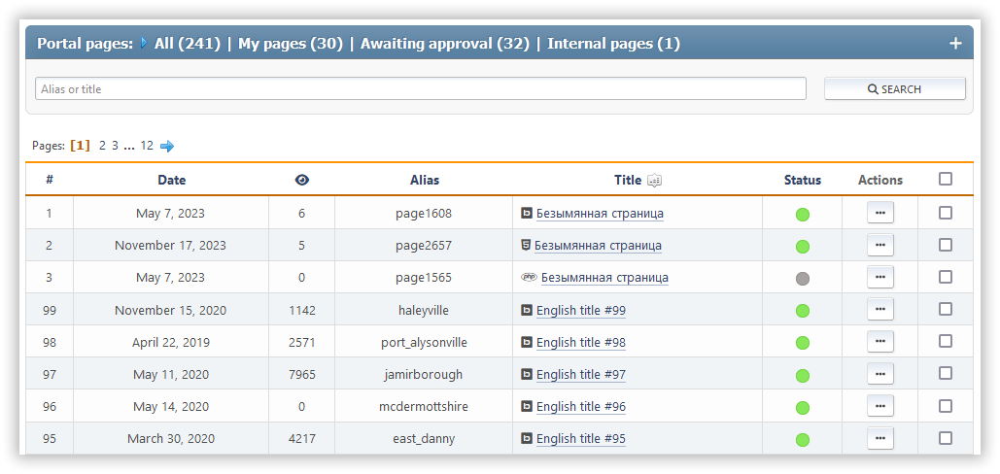

# Zarządzaj stronami

Ta sekcja zawiera listę wszystkich utworzonych stron portalu, które mogą być edytowane przez bieżącego użytkownika. Wyszukiwanie stron według tytułu lub slug.

Dla każdej strony, jej ID, data utworzenia/aktualizacji, liczba wyświetleń, liczba komentarzy, typ, slug, tytuł i lista akcji są wyświetlane.

Dla każdej strony dostępne są następujące działania:

- Przełącz status (włącz lub wyłączone)
- Edytuj — zmień wybraną stronę
- Usuń

Masowe akcje ze stronami są również dostępne.
