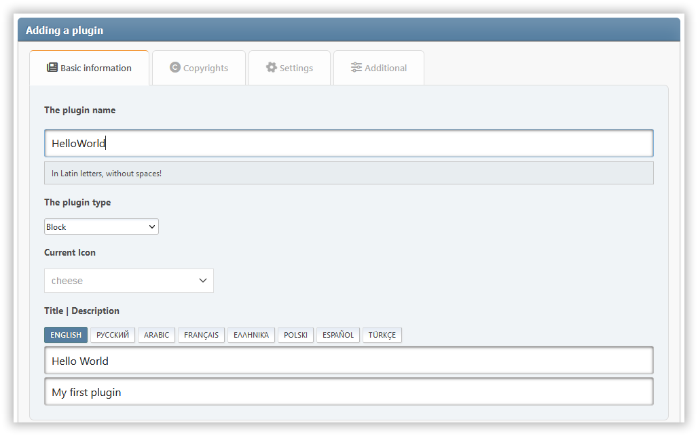

# Dodaj wtyczkę

Wtyczki to rozszerzenia, które rozszerzają możliwości Light Portal. Aby utworzyć własną wtyczkę, postępuj zgodnie z poniższymi instrukcjami.

## Wypis typów wtyczek

Aby zapewnić większe bezpieczeństwo typów i lepszą obsługę w środowisku IDE, zamiast wartości typu string w parametrze `type` można użyć wyliczenia `PluginType`:

```php
use LightPortal\Enums\PluginType;
use LightPortal\Plugins\PluginAttribute;

// Instead of: #[PluginAttribute(type: 'editor')]
#[PluginAttribute(type: PluginType::EDITOR)]

// Instead of: #[PluginAttribute(type: 'block')]
#[PluginAttribute(type: PluginType::BLOCK)]

// Instead of: #[PluginAttribute(type: 'other')]
#[PluginAttribute(type: PluginType::OTHER)]

// Or simply omit the type parameter since OTHER is default:
#[PluginAttribute]
```

Dostępne wartości typu wtyczki:

- `PluginType::ARTICLE` - do przetwarzania treści artykułów
- `PluginType::BLOCK` – dla bloków
- `PluginType::BLOCK_OPTIONS` – dla opcji bloku
- `PluginType::COMMENT` – dla systemów komentarzy
- `PluginType::EDITOR` – dla edytorów
- PluginType::FRONTPAGE\` – do wprowadzania zmian na stronie głównej
- `PluginType::GAMES` – dla gier
- `PluginType::ICONS` – dla bibliotek ikon
- `PluginType::IMPEX` – do importu/eksportu
- `PluginType::OTHER` – typ domyślny (można pominąć)
- `PluginType::PAGE_OPTIONS` – opcje strony
- `PluginType::PARSER` – dla narzędzi analizujących
- `PluginType::SEO` – do pozycjonowania stron
- `PluginType::SSI` – dla bloków zawierających funkcje SSI

W przypadku wtyczek rozszerzających klasy `Blok`, `Editor`, `Gra` lub `SSIBlock` typ jest automatycznie dziedziczony i nie trzeba go określać jawnie.

:::info Uwaga

Możesz użyć **PluginMaker** jako pomocnika do tworzenia własnych wtyczek. Pobierz i włącz na stronie _Admin -> Ustawienia portalu -> Wtyczki_.



:::

## Wybór typu wtyczki

Obecnie dostępne są następujące typy wtyczek:

| Typ                             |                                                                                                                       Opis |
| ------------------------------- | -------------------------------------------------------------------------------------------------------------------------: |
| `block`                         |                                                         Wtyczki, które dodają nowy typ bloków dla portalu. |
| `ssi`                           |              Wtyczki (zazwyczaj bloki), które używają funkcji SSI do pobierania danych. |
| `editor`                        |                                          Wtyczki, które dodają zewnętrzny edytor dla różnych typów treści. |
| `comment`                       |                           Wtyczki dodające komentarz firm trzecich zamiast wbudowanego widżetu komentarza. |
| `parser`                        |                                        Wtyczki, które zaimplementują parser dla zawartości stron i bloków. |
| `article`                       |                                     Wtyczki do przetwarzania zawartości kart artykułów na stronie głównej. |
| `frontpage`                     |                                                                  Wtyczki do zmiany strony głównej portalu. |
| `impex`                         |                                                   Wtyczki do importu i eksportu różnych elementów portalu. |
| `block_options`, `page_options` | Wtyczki, które dodają dodatkowe parametry dla odpowiedniej jednostki (blok lub strona). |
| `icons`                         |          Wtyczki, które dodają nowe biblioteki ikon do zastępowania elementów interfejsu lub do użytku w nagłówkach bloków |
| `seo`                           |                                        Wtyczki, które w jakiś sposób wpływają na widoczność forum w sieci. |
| `other`                         |                                             Wtyczki, które nie są związane z żadną z powyższych kategorii. |
| `games`                         |                                                Wtyczki, które zazwyczaj dodają blok zawierający jakąś grę. |

## Tworzenie katalogu wtyczek

Utwórz osobny folder dla swoich plików wtyczek w katalogu "/Sources/LightPortal/Plugins". Na przykład, jeśli wtyczka jest nazywana "HelloWorld", struktura folderów powinna wyglądać tak:

```
...(Plugins)
└── HelloWorld/
    ├── langs/
    │   ├── english.php
    │   └── index.php
    ├── index.php
    └── HelloWorld.php
```

Plik "index.php" może być skopiowany z folderów innych wtyczek. Plik "HelloWorld.php" zawiera logikę wtyczki:

```php:line-numbers {16}
<?php declare(strict_types=1);

namespace LightPortal\Plugins\HelloWorld;

use LightPortal\Plugins\Plugin;
use LightPortal\Plugins\PluginAttribute;

if (! defined('LP_NAME'))
    die('No direct access...');

#[PluginAttribute(icon: 'fas fa-globe')]
class HelloWorld extends Plugin
{
    public function init(): void
    {
        echo 'Hello world!';
    }

    // Other hooks and custom methods
}

```

## SSI

Jeśli wtyczka musi pobrać jakiekolwiek dane za pomocą funkcji SSI, użyj wbudowanej metody "getFromSsi(string $function, ...$params)". Jako parametr `$function` musisz podać nazwę jednej z funkcji zawartych w pliku **SSI.php**, bez prefiksu `ssi_`. Na przykład:

```php:line-numbers {17}
<?php declare(strict_types=1);

namespace LightPortal\Plugins\TopTopics;

use LightPortal\Plugins\Event;
use LightPortal\Plugins\PluginAttribute;
use LightPortal\Plugins\SsiBlock;

if (! defined('LP_NAME'))
    die('No direct access...');

#[PluginAttribute(icon: 'fas fa-star')]
class TopTopics extends SsiBlock
{
    public function prepareContent(Event $e): void
    {
        $data = $this->getFromSSI('topTopics', 'views', 10, 'array');

        if ($data) {
            var_dump($data);
        } else {
            echo '<p>No top topics found.</p>';
        }
    }
}
```

## Szablony Blade

Twoja wtyczka może korzystać z szablonu z językiem znaczników Blade. Na przykład:

```php:line-numbers {16,20}
<?php declare(strict_types=1);

namespace LightPortal\Plugins\Calculator;

use LightPortal\Plugins\Event;
use LightPortal\Plugins\PluginAttribute;
use LightPortal\Plugins\Block;
use LightPortal\Utils\Traits\HasView;

if (! defined('LP_NAME'))
    die('No direct access...');

#[PluginAttribute(icon: 'fas fa-calculator')]
class Calculator extends Block
{
    use HasView;

    public function prepareContent(Event $e): void
    {
        echo $this->view(params: ['id' => $e->args->id]);
    }
}
```

**Instrukcje:**

1. Jeśli katalog `views` w katalogu wtyczki jeszcze nie istnieje, utwórz go.
2. Utwórz plik `default.blade.php` o następującej treści:

```blade
<div class="some-class-{{ $id }}">
    {{-- Twoje oznaczenia. --}}
</div>

<style>
// Twój CSS
</style>

<script>
// Twój JS
</script>
```

## Composer

Wtyczka może korzystać z bibliotek firm trzecich zainstalowanych przez Composer. Upewnij się, że plik `composer.json`, który zawiera niezbędne zależności, znajduje się w katalogu wtyczki. Przed opublikowaniem wtyczki, otwórz katalog wtyczek w wierszu poleceń i uruchom polecenie: "composer install --no-dev -o". Następnie cała zawartość katalogu wtyczek może być zapakowana jako oddzielna modyfikacja dla SMF (na przykład patrz pakiet **PluginMaker**).

Na przykład:

::: code-group

```php:line-numbers {15} [CarbonDate.php]
<?php declare(strict_types=1);

namespace LightPortal\Plugins\CarbonDate;

use Carbon\Carbon;
use LightPortal\Plugins\Plugin;

if (! defined('LP_NAME'))
    die('No direct access...');

class CarbonDate extends Plugin
{
    public function init(): void
    {
        require_once __DIR__ . '/vendor/autoload.php';

        $date = Carbon::now()->format('l, F j, Y \a\t g:i A');

        echo 'Current date and time: ' . $date;
    }
}
```

```json [composer.json]
{
    "require": {
      "nesbot/carbon": "^3.0"
    },
    "config": {
      "optimize-autoloader": true
    }
}
```

:::
