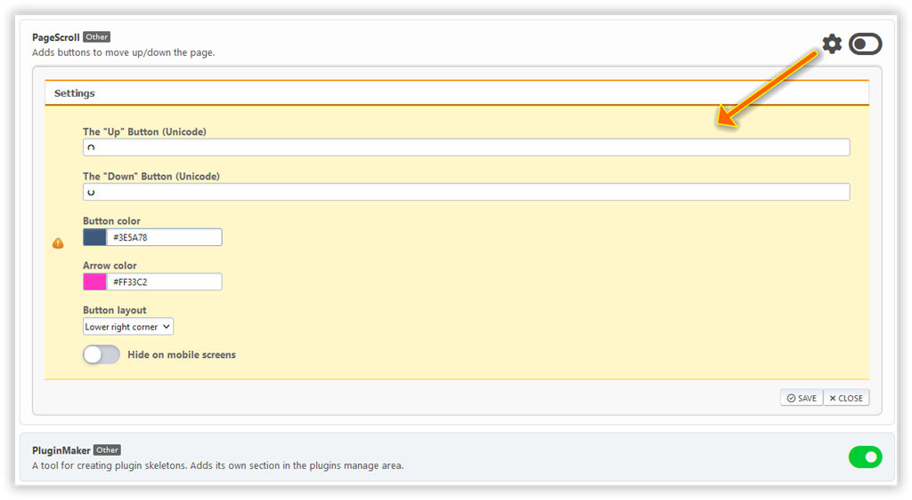

# Manage plugins

Wszystkie zainstalowane wtyczki portalu są tutaj wymienione. Niektóre z nich mają własne ustawienia.

Możesz przełączać się pomiędzy wyświetlaniem wtyczek w 1 kolumnie (domyślnie) lub 2 kolumny, jeśli chcesz.

Jeśli chcesz zmienić ustawienia wtyczki, kliknij na sprzęcie obok przycisku wtyczki.

## Instalacja dodatkowych wtyczek

Niektóre wtyczki nie są dołączone do portalu, muszą być zainstalowane oddzielnie. Takie wtyczki są podzielone na wtyczki do pobrania i bonusowe dostępne dla sponsorów projektu.

:::info Przypis

Dodatkowe wtyczki są również dostępne dla tłumaczy (jeśli co najmniej `LightPortal.{your_language}. hp` jest przetłumaczona w 100% jakości), jak również dla wszystkich [aktywnych uczestników](../how-to/help-to-project) projektu.

:::

Oddzielny pakiet wtyczek może być zainstalowany na stronie [Import wtyczek](./impex). Ale możesz także po prostu wyodrębnić folder wtyczki z pobranego archiwum i przenieść go do katalogu `Sources/LightPortal/Plugins`.
