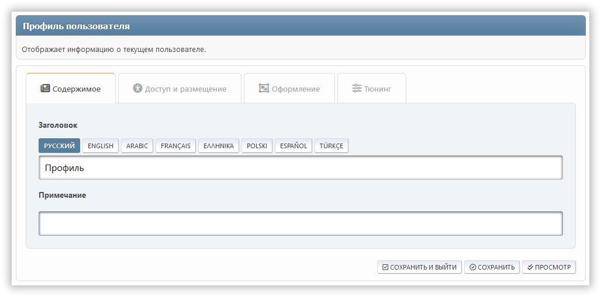
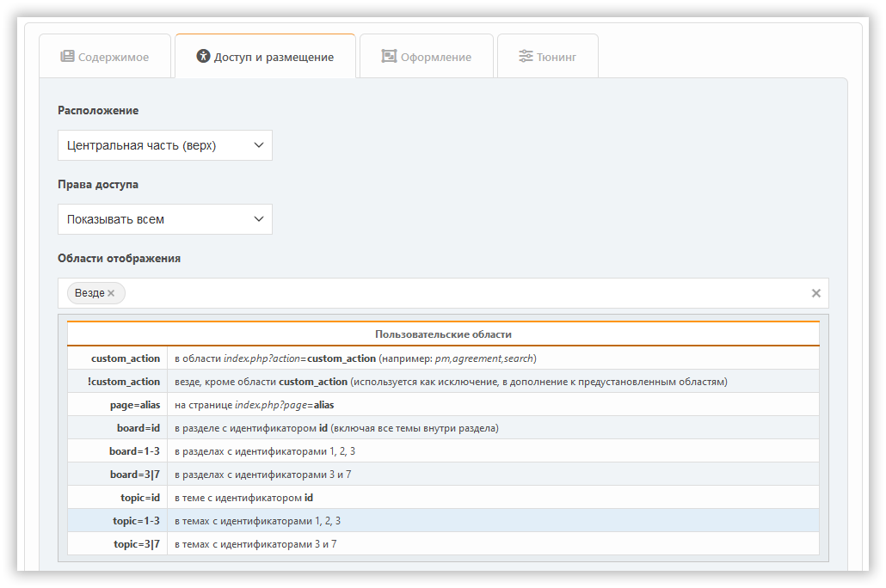
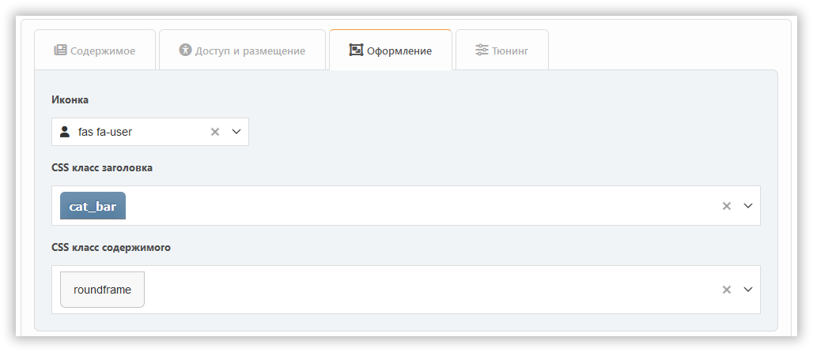
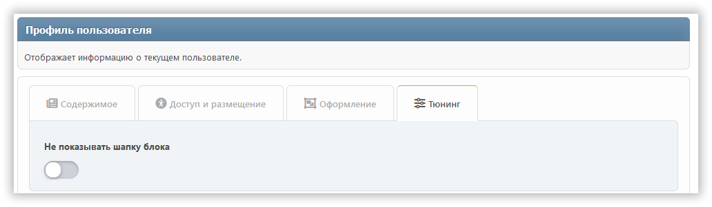

# Добавление блока

Чтобы добавить блок, просто нажмите на него. Изначально вы можете создавать блоки трёх типов: PHP, HTML и BBCode. Если вам нужны другие, сначала [включите необходимые плагины](../plugins/manage) с типом `block`.

В зависимости от типа блока будут доступны различные настройки, рассредоточенные по разным вкладкам.

## Типы блоков

### Встроенные типы контента

- **BBC**: Позволяет разметку BBCode для контента
- **HTML**: Сырой HTML-контент
- **PHP**: Выполняемый PHP-код (только для админов)

### Блоки, добавляемые плагинами

Блоки от плагинов расширяют функциональность портала. Примеры:

- **Markdown**: Включает синтаксис Markdown для контента
- **ArticleList**: Отображает статьи из тем/страниц с настраиваемыми параметрами отображения
- **Calculator**: Интерактивный виджет-калькулятор
- **BoardStats**: Общая статистика форума
- **News**: Последние объявления
- **Polls**: Активные опросы
- **RecentPosts**: Недавняя активность на форуме
- **UserInfo**: Информация о текущем пользователе
- **WhosOnline**: Список пользователей онлайн

## Вкладка «Контент»

Здесь можно настроить:

- заголовок
- примечание
- содержимое (только для некоторых блоков)

## Вкладка «Доступ и размещение»

Здесь можно настроить:

- расположение
- права доступа
- области

## Вкладка «Оформление»

Здесь вы можете настроить параметры внешнего вида блока.

## Вкладка «Тюнинг»

Специфические для конкретного блока настройки, как правило, доступны на вкладке **Тюнинг**.

Плагины могут добавлять свои собственные настройки в любой из этих разделов, в зависимости от намерений разработчиков.
